# ChainTrace AI

**Offline Bitcoin transaction-traffic correlation and ML triage prototype**
SIH 2026 · Problem statement **SIH26146** · NTRO · Cryptocurrency · Team of six

[](https://github.com/krish77-spec/chaintrace-ai/actions/workflows/ci.yml)
[](requirements.txt)
[](#16-offline-guarantees)
[](tests/)
[](GUIDE.md)
[](LICENSE)

---

## What this is, in one paragraph

ChainTrace AI reads two piles of evidence that nobody has time to cross-reference by
hand — raw Bitcoin **transaction** records and raw **computer-network** metadata — and
turns them into one investigation. It parses CSV, JSON and XML into a single schema,
enriches every IP with an offline country/ASN lookup, joins network observations to
transactions by TXID or by a ±90-second time window, and builds an entity/transaction
graph where wallets, transactions and IP addresses all live in one structure. On top of
that graph it runs **four real machine-learning analyses** (entity clustering, anomaly
detection, peeling-chain/CoinJoin detection, and risk propagation from known-bad seed
wallets), converts every finding into a **ranked, plain-English, hash-stamped alert**,
and presents the whole thing in an investigator console with a clickable relationship
map. It runs entirely offline: no live Bitcoin node, no cloud model, no external API —
synthetic data, locally trained models, and an offline GeoIP table.

**One command to run it:**

```bash
docker compose up --build      # dashboard → http://localhost:8501   API → http://localhost:8000/docs
```

> **New to the project?** This README is organised by *role* — who built what and how to
> verify their slice. If you want to understand the system rather than the team — what
> every file does, how the stages are wired, what the clusters and the threats actually
> mean, how to install Streamlit and drive the dashboard — read **[GUIDE.md](GUIDE.md)**
> and the twelve parts under `docs/` instead (Part 12 audits the dataset against SIH26146,
> Part 13 is the menu of possible X-factors).

---

## Table of contents

1. [Quick start](#1-quick-start)
2. [What the investigator actually sees](#2-what-the-investigator-actually-sees)
3. [How it satisfies every SIH26146 objective](#3-how-it-satisfies-every-sih26146-objective)
4. [Architecture](#4-architecture)
5. [**Part 1 — Person E: Data & Graph (the foundation)**](#part-1--person-e--data--graph-the-foundation)
6. [**Part 2 — Person A: AI/ML detection models**](#part-2--person-a--aiml-detection-models)
7. [**Part 3 — Person B: AI/ML clustering, graph AI & pipeline glue**](#part-3--person-b--aiml-clustering-graph-ai--pipeline-glue)
8. [**Part 4 — Person D: Backend APIs & control**](#part-4--person-d--backend-apis--control)
9. [**Part 5 — Person C: Frontend, the investigator dashboard**](#part-5--person-c--frontend-the-investigator-dashboard)
10. [**Part 6 — Person F: Integration, packaging, evidence integrity, docs**](#part-6--person-f--integration-packaging-evidence-integrity-docs)
11. [The four ML methods and why these ones](#11-the-four-ml-methods-and-why-these-ones)
12. [How explainability works](#12-how-explainability-works)
13. [Evidence integrity (SHA-256 ledger)](#13-evidence-integrity-sha-256-ledger)
14. [Command reference](#14-command-reference)
15. [Measured results on the bundled dataset](#15-measured-results-on-the-bundled-dataset)
16. [Offline guarantees](#16-offline-guarantees)
17. [Limitations (honest list)](#17-limitations-honest-list)
18. [Repository layout](#18-repository-layout)
19. [Troubleshooting](#19-troubleshooting)
20. [Live demo script](#20-live-demo-script)
21. [Deployment (GitHub + a live URL)](#21-deployment)

---

## 1. Quick start

### For judges / reviewers (nothing else needed)

```bash
docker compose up --build
# then open http://localhost:8501        (dashboard)
#           http://localhost:8000/docs   (API, interactive)
```

The image build installs the pinned dependencies, generates the synthetic dataset,
trains the models and runs one complete pipeline pass — so the dashboard has real
findings on its first paint. After the build finishes, the network can be unplugged:
the running system never reaches outside the container.

| Environment variable            | Default | Meaning |
|---------------------------------|---------|---------|
| `CHAINTRACE_RUN_ON_START`       | `auto`  | `auto` = run only if no alerts exist · `always` = re-run every start · `never` = never |
| `INSTALL_SHAP` (build arg)      | `0`     | `1` installs SHAP and switches the top alerts to real KernelSHAP values |
| `CHAINTRACE_API_PORT`           | `8000`  | API port |
| `CHAINTRACE_DASHBOARD_PORT`     | `8501`  | dashboard port (set automatically to **7860** on a Hugging Face Space, see §21) |
| `CHAINTRACE_LOG_LEVEL`          | `INFO`  | logging verbosity |

### Without Docker (development)

> Note: a Python 3.11 environment (`.venv311/`, ~1 GB) may already exist in this
> checkout — it was used to build and verify the prototype on the machine where Docker
> was unavailable. It is ignored by git and by the Docker build. Use it directly
> (`.venv311/bin/python scripts/run_full_pipeline.py`) or delete it with
> `rm -rf .venv311` and create your own.

```bash
python3.11 -m venv .venv && source .venv/bin/activate

pip install -r requirements-dev.txt        # runtime requirements + pytest

python scripts/generate_sample_data.py     # synthetic dataset with planted patterns
python scripts/audit_dataset.py            # 32 dataset-contract checks vs the SIH26146 brief
python scripts/train_models.py             # Isolation Forest + LOF, saved to data/models/
python scripts/run_full_pipeline.py        # all eight stages, writes data/artifacts/
python scripts/validate_detections.py      # precision/recall vs the planted ground truth

streamlit run app/dashboard.py             # dashboard on :8501
uvicorn src.api.main:app --port 8000       # API on :8000
pytest -q                                  # 64 tests, ~15 s
```

Or skip the Docker image entirely and let the app warm itself up — this is the same entrypoint the
hosted copy uses (Part 14), and it generates the dataset and runs the pipeline on first paint if it
has to:

```bash
streamlit run app/cloud_app.py             # dashboard on :8501, self-healing
```

---

## 2. What the investigator actually sees

Three screens, all fed by the artefacts the pipeline writes.

**Screen 1 — Ranked Alerts.** Ten live counters (records processed, network records,
ranked alerts, highest risk, entities clustered, peeling chains, mixing transactions,
anomalies flagged, evidence hashes, pipeline time), a filter bar (minimum risk, entity
type, free-text search), and the ranked alert table: *Alert · Entity · Type · Risk ·
Confidence · Top reason · Recommended action*. Selecting a row opens the full
explanation: the plain-English reasons, a bar chart of evidence strength per detector
(risk / peeling / mixing / anomaly / cluster / correlation), the model's feature
contributions, and the pipeline timings.

**Screen 2 — Interactive Graph.** The wallet ↔ transaction ↔ IP map, coloured by risk
score, by ownership cluster, or by node type; **node size grows with degree** (how many
connections a node has), never with the amount — amounts are read from the money-flow table
and the timeline; seed wallets are ringed and labelled. Tapping a node puts it in **focus**:
that node and its *direct* connections stay lit behind a coloured halo while the rest of the
graph fades to texture, every lit edge carries an **arrowhead pointing the way the money
moved**, the route you walked is kept as a dotted amber breadcrumbs line with the amounts on
it, and pressing **▶ Animate the money flow** (a control inside the chart, bottom-right, clear
of plotly's own zoom/pan toolbar) sends a coin down every lit hop from sender to receiver,
sized by the amount — the transfer is something you watch, not something you decode. A
**timeline replay** toggle swaps that for a **timeline slider under the chart** that scrubs the
collection window by hand. The snapshots are frames *inside* the figure, so dragging it moves
the window in place — no rerun, no chart re-render, no page reload — with a card in the corner
naming the moment and the running node/alert counts. It is entirely manual by design: the first
version auto-played the window in ~3 seconds, the second re-rendered the chart on every step of
a drag. Tapping a lit neighbour walks the ladder one hop further
(**⬅ Back one hop** retraces it, **🔄 Reset the graph** — always available — clears it and
hands back a chart with nothing selected). The focused entity gets its own
**timeline** — every transaction it took part in, in order, with amount, counterparty and
that counterparty's risk — plus a plain-English card of what it is and every alert that
mentions it. Because the layout remembers node positions for the session, the picture does
not jump under the cursor while you walk. The same graph (just the focus neighbourhood when
one is active) downloads as a self-contained interactive HTML file (`pyvis`, assets inlined
— no CDN, so it opens offline).

**Screen 3 — Evidence & Integrity.** For any selected alert: the complete evidence
package (peel chain hops, cluster members, risk paths to seeds, correlated network
records with country/ASN and time deltas, related transactions, financial summary), the
alert's SHA-256 hash, a **"Recompute SHA-256 and verify"** button that re-hashes the
package in front of the audience, the append-only ledger status, and JSON download
buttons for a single alert or the whole alert set.

---

## 3. How it satisfies every SIH26146 objective

| Official objective | How the prototype answers it | Where to look |
|---|---|---|
| Ingest & parse a bulk metadata dataset (timestamp, src/dst IP & port, TXID, input/output addresses, amounts, fee, script type) | CSV, JSON/JSONL **and** XML parsers normalise everything into one schema with the exact field list; malformed rows are dropped with a warning instead of crashing | `src/data/parsers.py` |
| Build an entity/transaction graph linking IPs, wallets and transactions | `networkx.MultiDiGraph` with three node types (`wallet`, `txid`, `ip`) and edge semantics `wallet→txid` (input), `txid→wallet` (output), `ip→txid` (correlation confidence) | `src/graph/builder.py` |
| Implement an AI/ML detection use case with a **working model** — not just rules | Four trained/learned analyses: Isolation Forest **+ LOF** anomaly detection (real `scikit-learn` models, persisted with `joblib`), common-input + Louvain entity clustering, score-based peeling/CoinJoin detection, Personalized PageRank risk propagation | `src/ml/*.py` |
| Generate a ranked, explainable alert list with a confidence score | Every alert carries risk score, **agreement-based confidence**, plain-English reasons, feature contributions, a recommended action, and a SHA-256 evidence hash; the list is ranked and diversity-guaranteed across detector families | `src/ml/explain.py` |
| Present findings via a dashboard / link-analysis visualisation | Three-screen Streamlit console (alerts table, interactive graph, evidence & integrity) plus a standalone offline graph HTML export | `app/dashboard.py`, `scripts/export_graph_html.py` |
| Workable complete offline solution for Linux | Docker image (`python:3.11-slim`) with build-time data generation and model training; runtime needs no network; local GeoIP table; no cloud model | `Dockerfile`, `docker-compose.yml`, `entrypoint.sh` |
| Working prototype (code repo) with ingestion, correlation and AI/ML model | This repository: ~7.9k lines across the exact directory structure in the specification, plus 20 automated tests | `src/`, `tests/` |
| Short technical write-up: approach, model choice, explainability method | Sections 11–13 of this README | this file |
| Dashboard/visualisation showing flagged entities **and evidence for each flag** | Evidence tab: reasons, features, related transactions, network evidence, hash verification, ledger | `app/dashboard.py` (tab 3) |

---

## 4. Architecture

```mermaid
flowchart LR
    A[Raw CSV / JSON / XML] --> B[1 · Ingest<br/>parsers.py]
    B --> C[2 · Enrich<br/>enrich.py<br/>offline GeoIP]
    C --> D[3 · Correlate<br/>correlator.py<br/>TXID exact + ±90s window]
    D --> E[4 · Graph<br/>builder.py<br/>NetworkX MultiDiGraph]
    E --> F1[5a · Features<br/>features.py]
    F1 --> F2[5b · Clustering<br/>common-input + Louvain]
    F2 --> F3[5c · Anomaly<br/>Isolation Forest + LOF]
    F3 --> F4[5d · Peeling & Mixing<br/>chain walk + CoinJoin shape]
    F4 --> F5[5e · Risk<br/>Personalized PageRank + hub-damped decay + cluster inheritance]
    F5 --> G[6 · Explain<br/>reasons · contributions · confidence]
    G --> H[8 · Evidence lock<br/>SHA-256 + ledger]
    G --> I[(alerts.json)]
    H --> I
    E --> J[(graph.json)]
    I --> K[7 · Dashboard<br/>Streamlit]
    J --> K
    I --> L[FastAPI<br/>:8000]
    J --> L
```



Everything in the middle column is reproducible from a seed: `RANDOM_SEED = 42` drives
random, NumPy and Faker, so two runs on the same input files produce identical output.

---

## Part 1 — Person E · Data & Graph (the foundation)

*What Person E built, and how to check it.*

Person E owns the world the detection happens in: the synthetic case file, the parsers
that turn three messy formats into one clean table, the offline GeoIP enrichment, the
network↔transaction correlation, and the graph itself.

**Everything they built**

| Piece | File | What it does |
|---|---|---|
| Synthetic dataset generator | `src/data/generator.py` | Creates 1,200 transactions, ~520 wallets and ~300 network records (each carrying `geo_country`/`geo_asn`), emits the split files *and* a single combined `bulk_metadata.csv`, and writes a ground-truth manifest |
| CLI for the dataset | `scripts/generate_sample_data.py` | Writes `transactions.csv`, `network_metadata.csv`, the combined `bulk_metadata.csv`, `seed_illicit_wallets.json`, `planted_patterns.json` |
| Dataset contract audit | `scripts/audit_dataset.py` | 32 checks against the problem statement's minimum fields, size envelope, planted patterns and value integrity; exit code is a CI gate (`tests/test_dataset_contract.py`) |
| Normalising parsers | `src/data/parsers.py` | CSV / JSON / JSONL / XML → one schema; list fields (`a|b`, `a,b`, `["a","b"]`, `<address>` children) all handled; broken rows dropped with warnings |
| Offline GeoIP | `src/data/enrich.py` | MaxMind GeoLite2 `.mmdb` if present in `data/geo/`, otherwise a deterministic SHA-256 → country/ASN table; adds private-IP, IP-version and cross-border flags |
| Correlator | `src/correlation/correlator.py` | Exact TXID match (confidence 1.0) plus a ±90 s time-window match with linear confidence decay and an ambiguity penalty when several transactions sit inside the window |
| Graph builder | `src/graph/builder.py` | `MultiDiGraph` with `wallet` / `txid` / `ip` nodes, typed edges, node statistics (degree, totals, first/last seen, counterparties, amount mean/std, lifetime), `get_subgraph`, `get_neighbourhood`, `get_stats`, cached wallet projection, `graph.json` export |

**How the planted patterns work.** The generator plants exactly what the brief asks a
detector to find: 3–6 peeling chains of 4–8 hops (each hop 1 input → 2 asymmetric
outputs, value decreasing, timestamps strictly increasing, some starting or ending at a
seed wallet); 5–8 known-bad seed wallets that also receive ordinary-looking payments so
risk can propagate; 3–6 multi-input co-spending groups (one of which is a laundering
ring that receives peeled value *and* consolidates into a seed); 8–14 anomalous
transactions (extreme fee ratio, very large amount, unusual script type, rapid burst of
small transfers, extreme fan-in, extreme fan-out); 2–3 CoinJoin-shaped transactions
(≥5 inputs, ≥5 near-equal outputs); and network records for the suspicious transactions,
about half carrying the TXID and the rest planted inside the ±90 s window, reusing a
small pool of "attacker" IPs. Everything is written twice: once as data, once as a
**ground-truth manifest**, so detection quality can be *measured* rather than asserted.

**Why the seed list matters.** `seed_illicit_wallets.json` is the analyst's prior
knowledge — the equivalent of a sanctions list. It is the only place where "guilt" enters
the system; everything else is inferred.

**How to check Person E's work**

```bash
python scripts/generate_sample_data.py            # prints the planted-pattern counts
python scripts/validate_detections.py             # compares detectors to the manifest
python -c "
from src.data import parsers; tx, net, seeds = parsers.load_input_bundle('data/synthetic')
print(len(tx), len(net), len(seeds)); print(tx.iloc[0].to_dict())"
```

`tests/test_pipeline.py` locks this in with tests for reproducibility, planted-pattern
counts, monotonic chain timing, CSV/JSON/XML equivalence, broken-row tolerance and
deterministic GeoIP.

---

## Part 2 — Person A · AI/ML detection models

*Three of the four required AI jobs, plus the features that feed them and the
explanations that make them usable.*

**Feature engineering (`src/ml/features.py`).** Two matrices, fixed column order:
24 transaction features (`num_inputs`, `num_outputs`, `fee_ratio`, `amount_ratio`,
output/input coefficient of variation, `is_1in_2out`, consolidation/fan-out flags, dust
outputs, asymmetry, script-type encoding, correlation confidence, network time delta,
offshore-geo flag, CoinJoin shape) and 27 wallet features (`in_degree`, `out_degree`,
`total_received`, `total_sent`, `unique_counterparties`, `avg_tx_amount`,
`std_tx_amount`, `lifetime_hours`, transaction rate, burstiness inside any 60-second
window, max fan-in/fan-out, `fraction_of_peel_like_txs`, peel-chain length, mixing
participations, cluster size, PageRank, risk components, hops to seed, correlated-IP
count, distinct source countries, seed flag).

**Anomaly detection (`src/ml/anomaly.py`).** `IsolationForest`
(`contamination=0.06`, 200 trees) is the primary model — it isolates what is easy to
separate, which in this data means the transaction that does not look like its
neighbours. `LocalOutlierFactor` (novelty mode, 20 neighbours) runs as a secondary
density-based view and the two rank-normalised scores are blended 65/35. The top 6 % of
the blended score is flagged. Both models, the scaler and the exact feature order are
persisted with `joblib` to `data/models/`, so a demo never retrains. The same class is
reused for wallet-level anomalies, which feed wallet alerts.

**Peeling-chain and mixing detection (`src/ml/peeling.py`).** Candidate peel hops are
1-input/2-output transactions with asymmetry > 0.75 and a non-dust peel output. From
every candidate the detector walks forward along the *large* output, up to 8 hops,
choosing the next hop by **value continuity** (the spender whose input amount is closest
to what the previous hop forwarded) and only accepting hops that occur *after* the
current one. All walks are then ranked by length and value and assigned greedily so one
transaction belongs to exactly one chain; chains shorter than 3 hops are rejected.
Each chain is scored on length, mean asymmetry, value moved and seed proximity.
CoinJoin-style mixing is detected by shape: ≥5 distinct inputs, ≥5 outputs whose
coefficient of variation is below 0.15, and a rejection rule that ignores repeated
addresses (which would indicate one owner recycling coins).

**Risk scoring (`src/ml/risk.py`).** Three mechanisms, blended:

1. **Personalized PageRank** over the wallet projection, personalised on the seed
   wallets, normalised to the peak.
2. **Hub-damped proximity decay** — a weighted shortest-path search where passing
   *through* a wallet with more than `HUB_DEGREE = 15` counterparties costs extra.
   Sharing an exchange hub with a criminal is weak evidence; a direct payment chain is
   strong evidence, and this keeps 400+ wallets from inheriting seed risk.
3. **Cluster inheritance** — wallets that co-spend are one owner, so a risky member
   raises the whole cluster, discounted 15 % because the ownership inference is itself
   probabilistic. Only *evidenced* common-input clusters inherit; inferred Louvain
   communities do not, and clusters larger than `CLUSTER_INHERIT_MAX_SIZE = 30` are
   treated as collapsed and excluded (with a warning in the log).

Transaction risk then blends the highest-risk wallet touching the transaction (55 %)
with the transaction's own anomaly/peel/mixing evidence (45 %).

**Explainability (`src/ml/explain.py`).** See section 12.

**How to check Person A's work**

```bash
python scripts/train_models.py            # prints flagged counts and top features per model
python -c "
import json; m=json.load(open('data/models/training_metadata.json'))
print(m['transaction_model']['top_features'][:5])"
pytest tests/test_pipeline.py -q -k "anomaly or peeling or mixing or risk"
```

---

## Part 3 — Person B · AI/ML clustering, graph AI & pipeline glue

*The fourth AI job, plus the piece that makes four separate analyses behave like one
system.*

**Entity clustering (`src/ml/clustering.py`).** Two layers, in the order the brief asks
for. First the **common-input-ownership heuristic**: a Union-Find over every
multi-input transaction, with merge guards — transactions with more than five inputs and
CoinJoin-shaped transactions are excluded, because a single exchange sweep would
otherwise fuse thousands of unrelated wallets into one "owner" (the classic
chain-merge collision). Second, **Louvain community detection** on the wallet-to-wallet
projection, giving broader behavioural grouping for wallets that never literally
co-spend. Final labels prefer hard evidence (common-input) and fall back to soft
evidence (Louvain), and every address records which produced its label, so the
dashboard can be honest about it. NetworkX's Louvain is seeded, so results are stable.

**Stage wiring (`src/pipeline/runner.py`).** One function,
`run_full_pipeline(input_dir, output_dir)`, executes the eight stages in the order the
specification prescribes, records per-stage timings, threads each stage's output into
the next (transaction features feed the anomaly model; cluster labels feed risk
inheritance; anomaly/peel/mixing scores feed both risk and the explainer), attaches ML
results back onto graph nodes, and writes every artefact: `graph.json`, `alerts.json`,
`pipeline_summary.json`, the feature CSVs, the correlated records, the `.joblib` models,
the ledger and the explainer metadata. It takes an optional `progress` callback, which
is what lets the API report job progress and the dashboard show a stage ticker. It is
callable from the CLI, from FastAPI and from Streamlit — the same function in all three
places.

**Callability.** Every stage is importable and runnable on its own
(`pytest -q -k clustering`, `scripts/train_models.py`, `detect_peeling_and_mixing(...)`),
which matters when six people work on six slices in parallel.

**How to check Person B's work**

```bash
python -c "
import pandas as pd
from src.data import parsers; from src.graph.builder import GraphBuilder
from src.ml import clustering as C
tx,_,seeds = parsers.load_input_bundle('data/synthetic')
b = GraphBuilder(tx, None, seeds=seeds).build()
r = C.cluster_entities(b, tx); print(r.summary()); print(r.stats.head(8))"
python scripts/run_full_pipeline.py --quiet     # prints per-stage timings
pytest tests/test_pipeline.py -q -k "clustering or summary"
```

---

## Part 4 — Person D · Backend APIs & control

*The stock room and delivery system behind the shop window.*

**The API (`src/api/main.py`, `routes.py`, `schemas.py`).** FastAPI with Pydantic models
and an in-memory job registry (explicitly allowed for a prototype — no Redis):

| Endpoint | Purpose |
|---|---|
| `GET /health` | liveness plus an inventory: artefacts ready, alerts loaded, ledger entries, seed count, which model files exist |
| `POST /upload` | accepts CSV/JSON/JSONL/XML files, validates extensions, stores them under `data/raw/upload_<timestamp>/` |
| `POST /run` | starts the full pipeline as a background job; `input_dir` supports the bundled sample, an uploaded folder (`use_uploaded_files`) or any path |
| `GET /status/{job_id}` | stage name, stage index, progress fraction, timings, error, and the full summary when finished |
| `GET /alerts` | ranked list with `min_risk`, `limit`, `entity_type` filters |
| `GET /alerts/{alert_id}` | full evidence package for one alert |
| `GET /graph` | nodes + edges, optionally centred on a node with a depth parameter |
| `GET /graph/{node_id}` | neighbourhood convenience route |
| `GET /stats` | everything the dashboard header needs in one call: counts, graph stats, clustering/risk/correlation details, alert breakdown, stage timings, top alerts |
| `GET /ledger`, `GET /ledger/verify` | the append-only evidence ledger and a re-hash verification report |

Startup behaviour is configurable (`CHAINTRACE_RUN_ON_START=auto|always|never`); on
`auto` the API boots instantly and warms the pipeline in a background thread only if no
alerts exist yet, so the container never blocks on analysis.

**How to check Person D's work**

```bash
uvicorn src.api.main:app --port 8000 &
curl -s localhost:8000/health | python -m json.tool
curl -s "localhost:8000/alerts?min_risk=0.8&limit=3" | python -m json.tool
curl -s localhost:8000/ledger/verify | python -m json.tool
curl -F "files=@data/synthetic/transactions.csv" localhost:8000/upload
curl -X POST localhost:8000/run -H 'content-type: application/json' -d '{"use_uploaded_files":true}'
pytest tests/test_pipeline.py -q -k api
```

---

## Part 5 — Person C · Frontend, the investigator dashboard

*The only screen a judge or investigator actually looks at.*

Person C built four screens in `app/dashboard.py`, on a dark "investigator console"
theme (`.streamlit/config.toml` plus a small CSS layer):

1. **🎯 Ranked Alerts** — counters, filters, the ranked table (risk drawn as a progress
   bar), the selected alert's reasons, a per-detector evidence bar chart, feature
   contributions, recommended action, and stage timings annotated with who owns which
   stage.
2. **🕸 Interactive Graph** — Plotly network layout (seeded) with colour-by
   risk/cluster/type, node-size-by-degree, hover dossiers, **click-to-focus** (head node +
   direct connections lit, everything else faded, amber breadcrumbs for the route walked),
   a hop dropdown, a clickable connections table and an always-available **🔄 Reset the graph**
   button that walk (and unwind) the same ladder, the focused
   entity's **own timeline** (one dot per connection, sized by amount), the alerts that
   mention it, a timeline replay scrubber, and a download of the neighbourhood as a
   self-contained pyvis HTML.
3. **🔒 Evidence & Integrity** — the evidence package, the SHA-256 hash, an in-UI
   re-verification button (it recomputes the hash live and reports match/mismatch), the
   ledger status card, and downloads for one alert or all of them.

**Control surface.** The sidebar has *Run Analysis* (three inputs: bundled sample,
uploaded files, or regenerate-then-analyse) with a live stage ticker, a file uploader
that stores CSV/JSON/XML into `data/raw/upload_*`, and the global filters
(minimum risk, entity type, free-text search across entities and reasons).

**Wiring.** The dashboard talks to the FastAPI backend when it answers
(`CHAINTRACE_API_URL`) and silently falls back to reading `data/artifacts/` from disk,
so a demo cannot be derailed by one process being down. The *Run Analysis* button calls
the pipeline in-process with a progress callback, which is why it works with the API
stopped.

**How to check Person C's work**

```bash
streamlit run app/dashboard.py            # then open http://localhost:8501
pytest tests/test_dashboard.py -q          # headless dashboard render test
python scripts/export_graph_html.py --open # standalone offline graph file
```

---

## Part 6 — Person F · Integration, packaging, evidence integrity, docs

*Keeping the seams from showing, and making sure the finished thing is explainable.*

**Docker packaging (`Dockerfile`, `docker-compose.yml`, `entrypoint.sh`).** The image is
`python:3.11-slim` with pinned dependencies. The build installs requirements, copies the
code, generates the sample data, trains the models, runs one full pipeline pass, and
exposes 8000/8501. The `pip` download cache is a BuildKit cache mount rather than an
image layer, so a repeated or interrupted build resumes instead of re-downloading the
whole wheel set while the final image stays lean. The entrypoint then: regenerates data if the mounted volume is empty,
trains models if any are missing, warms artefacts if they are absent, starts Uvicorn in
the background, waits for `/health` to answer, and runs Streamlit in the foreground so
its logs stay visible. A container `HEALTHCHECK` polls the API. `INSTALL_SHAP=1` is an
opt-in build argument that adds real SHAP values.

**Evidence integrity (`src/utils/hashing.py`).** Every alert's evidence is serialised as
canonical JSON (sorted keys, compact separators, NaN rejected), hashed with SHA-256, and
stamped on the alert; one line per alert is written to
`data/evidence_ledger.jsonl` — an append-only record containing the alert id, entity,
hash, risk score and timestamp. Each entry is written exactly once through a single file
handle: an earlier version wrote it both through that handle and through a short-lived
second handle opened in append mode, leaving two offset streams to interleave over one
file. `verify_ledger()` recomputes every hash and compares it
both to the stored value and to the ledger, so silent edits are detectable. The
dashboard's *Recompute SHA-256 and verify* button runs exactly that check in front of
the audience, and `GET /ledger/verify` exposes it over HTTP.

**What is deliberately *not* built** — no live Bitcoin node, no real intercept feed, no
second blockchain to store anything on, no cloud model at runtime. Cloud tools were fine
while writing code; the delivered system runs with the cable unplugged.

**This write-up.** Sections 11–13 cover approach, model choice and the explainability
method; section 15 reports measured detection quality; section 17 lists limitations
honestly.

**How to check Person F's work**

```bash
bash -n entrypoint.sh                     # syntax check the entrypoint
docker compose config | head -40          # validate the compose file
python -c "
from src.pipeline.runner import load_alerts; from src.utils.hashing import verify_ledger
print(verify_ledger(load_alerts()))"
head -3 data/evidence_ledger.jsonl
pytest -q                                 # the whole suite
```

---

## 11. The four ML methods and why these ones

### 11.0 What kind of AI this is — and what it deliberately is not

There is **no LLM and no neural network** anywhere in ChainTrace AI. The AI here is
**unsupervised machine learning plus graph algorithms**: models that learn *structure* from
the dataset in front of them instead of generating text, and it is the right family of AI for
this problem rather than a shortcut. An investigator has no labelled history on their own
blockchain traffic, so anything trained on someone else's labels is guessing; unsupervised
detectors flag what is *statistically unlike the rest of this graph*, which is exactly the
question "which of these 1,200 transactions is off?"

| | |
|---|---|
| **Learned (real `scikit-learn`)** | `IsolationForest` — 200 trees, contamination 0.06, seeded (seed 42) — + `LocalOutlierFactor` (k=20, novelty) blended in at weight 0.35, both on a `StandardScaler`-normalised matrix; **24 transaction features** and **27 wallet features** built by `src/ml/features.py` (fee ratios, output-value CV, asymmetry, dust outputs, burstiness, fan-in/out, peel fraction, PageRank, hops-to-seed, correlated IPs, country spread). Rank-normalised, top 6 % flagged |
| **Learned (graph)** | Union-Find common-input ownership + **Louvain** communities on the wallet projection (`networkx`, resolution 1.0, seeded) → 33 ownership clusters |
| **Computed (graph / statistical, not learned)** | **Personalized PageRank** personalised on the seed wallets, blended 0.6/0.4 with a hub-damped BFS proximity decay (decay 0.7/hop, 6 hops, degree ≥ 15 damps) — and the peeling-chain walk, kept deterministic on purpose so every hop can be re-derived by hand |
| **Deliberately not AI** | The plain-English explanations, the severity ladder, the SHA-256 evidence ledger and the case-file export: for court-facing evidence, reproducible arithmetic beats a generator |

**How it is "trained".** Every analysis is fit **on the dataset being analysed**, in the run — the
learning is unsupervised and transductive, there are no shipped pre-trained weights, and no label
ever touches the models. The 78 planted-illicit / 15 planted-benign wallets exist only for
*measurement*: `scripts/benchmark_detectors.py` scores the detectors against them and against the
benign look-alikes (X-factor C) — evaluation, not training, so the reported precision/recall is
honest. The fitted forest, scaler and exact feature order are persisted with `joblib`
(`data/models/*.joblib` + `training_metadata.json`), so a demo run loads a model instead of
retraining; `python scripts/train_models.py` performs stage 5a standalone. Because the seed is
fixed and Louvain/forest are seeded, the same input always produces byte-identical alerts.
**Explainability is model-side, not bolted on:** global importance (Isolation Forest's own
`feature_importances_`, else permutation importance against the anomaly score), multiplied by how
far the entity deviates from the population, and real KernelSHAP for the top alerts when `shap` is
installed — the alert records which method produced its numbers.

| # | Method | Implementation | Why this method |
|---|---|---|---|
| 1 | **Entity clustering** | Common-input-ownership Union-Find with merge guards → Louvain communities on the wallet projection | The heuristic is the established, explainable Bitcoin ownership signal ("these keys were spent together"); Louvain adds behavioural grouping where co-spending never happened. Both are dependency-free in NetworkX |
| 2 | **Anomaly detection** | `IsolationForest` (primary) + `LocalOutlierFactor` (secondary), blended, rank-normalised, persisted | Unsupervised — there are no labels in a real investigation. Isolation Forest handles mixed feature scales and mixed outlier *shapes*; LOF catches local density outliers that a global tree ensemble misses. Both are fast enough for an investigator's laptop |
| 3 | **Peeling-chain / mixing detection** | Candidate shape test + forward chain walk chosen by value continuity, then a weighted chain score; CoinJoin detected by input/output count and output coefficient of variation | Laundering structure is *sequential*, so it is detected by walking the graph, not by looking at single transactions. Value continuity is what a human analyst uses to follow the trail, and it makes the walk robust when a seed or cash-out wallet is also spent by unrelated transactions |
| 4 | **Risk scoring** | Personalized PageRank over the wallet graph + hub-damped proximity decay + cluster inheritance, seeds pinned at 1.0 | Risk must flow *outward* from known-bad wallets, but naively it floods the graph: everything is two hops from an exchange. PageRank handles propagation structurally, hub damping prices the difference between "shares a hub with a criminal" and "was paid by one", and cluster inheritance respects the fact that one owner can hold many addresses |

All four are trained or computed on the dataset itself and all four contribute to the
final score through explicit weights (`config.SCORE_WEIGHTS`), with a severity ladder so
the single strongest corroborated signal cannot be diluted by weak ones — a known-bad
seed wallet stays at 0.95, a multi-hop peeling chain reaches ~0.85, a CoinJoin-shaped
transaction ~0.75, a statistically extreme transaction ~0.70.

---

## 12. How explainability works

Three layers, all visible in the UI and present in the JSON.

**1. Plain-English reasons.** Deterministic templates filled from the evidence, e.g.

- *"Participates in peeling chain PC-01 of length 6 hops (hop 3)"*
- *"Peeling chain routes peeled value into a known illicit seed wallet"*
- *"2 hops from a known illicit seed wallet"*
- *"High anomaly score from the Isolation Forest model (99th percentile)"*
- *"CoinJoin-like mixing structure detected (score 0.74: many inputs, near-equal outputs)"*
- *"Belongs to a cluster of 9 wallets that share common-input ownership (likely one real-world owner)"*
- *"The ownership cluster contains a wallet that is already high-risk, so the whole entity is treated as exposed"*
- *"3 network record(s) correlated with this transaction from NL, SC (best confidence 1.00 via txid_exact)"*

**2. Feature attribution.** Preferred path is **real KernelSHAP** over the trained
Isolation Forest (`shap` installed via `requirements-shap.txt` or
`docker compose build --build-arg INSTALL_SHAP=1`), used only for the top alerts because
KernelSHAP is slow by design. Because SHAP ≥ 0.45 forces `numpy>=2` and conflicts with
the pinned core stack, the *default* path is a clearly-labelled **importance surrogate**:
the model's global feature importance multiplied by how far this entity's value deviates
from the population (in standard deviations), renormalised so the displayed contributions
sum to 1. The alert records which method produced its numbers
(`"explainer": "shap_kernel"` or `"importance_surrogate"`, echoed in the evidence as
`explanation_method`), so nobody is misled about the provenance of a number.

**3. Confidence (not the same thing as risk).** Confidence measures *agreement between
independent detectors*: the mean of the top three component strengths, blended with how
many detector families independently fired above 0.4. A wallet that is a seed, sits in a
tainted ownership cluster and is one hop from itself scores ~1.0; a single standalone
peel-shaped transaction (a shape that a quarter of ordinary payments also produce) stays
low, and the alert's recommended action reflects that ("Monitor", not "Escalate").

Each alert also carries a **recommended action** derived from score, seed proximity and
hop distance — the difference between *"Escalate — request full wallet history and
freeze-linked counterparties"* and *"Monitor — queue for the next review cycle"*.

---

## 13. Evidence integrity (SHA-256 ledger)

```
data/evidence_ledger.jsonl
{"type":"ledger_header","created_at":"...","hash_algorithm":"SHA-256","chaining":"..."}
{"alert_id":"CT-W-...","hash":"9f2c...","prev_hash":"000...0","entry_hash":"ab41...","risk_score":0.95,...}
{"alert_id":"CT-W-...","hash":"7d10...","prev_hash":"ab41...","entry_hash":"c3e9...","risk_score":0.95,...}
```

* The hash covers the *investigative substance* of the alert (reasons, evidence,
  counterfactual, features, scores) and deliberately excludes volatile fields such as
  `generated_at`, so re-verification is meaningful.
* Canonical JSON (sorted keys, compact separators, `allow_nan=False`) guarantees the
  same package always hashes to the same digest.
* **The ledger is a hash chain, not a list.** Each entry stores the previous entry's
  `entry_hash`, so deleting, reordering or editing any historical row breaks every link
  after it — and `verify_ledger_chain()` names the *position* of the first break.
  Measured on the demo ledger: `60 entries, chained yes, intact YES`; the tamper demo
  (which edits a copy in memory) is caught at entry 31.
* `verify_ledger()` re-hashes every alert and compares it against both the alert and the
  ledger, reporting verified / mismatched / missing counts, plus the chain status.
* In the dashboard: **🔗 Verify the whole hash chain** and **🕵 Simulate tampering** on the
  Evidence & Integrity tab. From a shell:
  `python -m src.utils.hashing --verify` (exit 0 = intact, 1 = broken) and
  `--tamper-demo`.
* Tampering with a reason line changes the hash, and tampering with a ledger row breaks the
  chain — both are asserted in `tests/test_pipeline.py` and `tests/test_xfactors.py`.

---

## 14. Command reference

```bash
# data
python scripts/generate_sample_data.py [--transactions 1200 --wallets 450 --network 320 --seed 42]

# models only (stage 5a path, standalone)
python scripts/train_models.py [--input data/raw]

# everything (the eight stages)
python scripts/run_full_pipeline.py [--input data/synthetic --output data/artifacts --regenerate-sample]

# does the data match the SIH26146 brief? (35 checks, exit 0 only if all pass)
python scripts/audit_dataset.py [--input data/synthetic --json data/artifacts/dataset_audit.json]

# precision against innocent look-alikes, next to a rules-only baseline
python scripts/benchmark_detectors.py [--input data/synthetic --artifacts data/artifacts]

# evidence-integrity CLI (exit 1 if the chain is broken)
python -m src.utils.hashing --verify
python -m src.utils.hashing --tamper-demo

# honesty check against the planted ground truth
python scripts/validate_detections.py

# standalone interactive graph (self-contained HTML, offline)
python scripts/export_graph_html.py [--max-nodes 400 --open]

# services
streamlit run app/dashboard.py
uvicorn src.api.main:app --host 0.0.0.0 --port 8000

# tests (run against a throwaway data directory - see tests/conftest.py)
pytest -q
```

Every path under `data/` is redirected to a temporary directory for the duration of the
test session, so running the suite never overwrites the artefacts of your last real run.
(Without that isolation `pytest` replaced `data/evidence_ledger.jsonl` with the *test*
dataset's ledger, and the dashboard then reported the untouched alerts as missing from
the ledger.)

---

## 14b. Two cross-stage defects found while wiring the guide together

Both were invisible to the test suite before it grew, and both are the kind of bug that only
shows up when you follow the data rather than the functions.

**`graph.json` was never annotated.** Stage 4 writes the graph export; stage 5f applies the
node attributes (`cluster_id`, `risk_score`, peel/anomaly scores). Because the export
happened first, the file the API and the dashboard render carried `risk_score: 0.0` and
`cluster_id: null` for all 516 wallets — so the graph tab coloured every node as low-risk
and every tooltip read *risk 0.000 · cluster "-"*, while the analytics behind it were
perfectly good. The runner now re-exports the graph after the annotations are applied, and
`test_exported_graph_carries_risk_and_cluster_annotations` asserts the exported payload
carries risk, cluster ids and the pinned seed risk.

**The alert layer contradicted the risk layer about collapsed clusters.** `risk.py` refuses
to inherit risk through a component larger than `CLUSTER_INHERIT_MAX_SIZE` (30 wallets) —
the 347-wallet chain-merge collision in the bundled dataset is exactly that case. But
`explain.py` still granted such a component full `cluster: 1.0` evidence whenever any member
was a seed, i.e. 12 alerts claimed "this entity is exposed" through a grouping the risk model
had deliberately rejected. The two layers now agree: a collapsed component earns `0.0`
evidence, and the alert says so out loud (*"Excluded from ownership-based reasoning: this
address sits in a 347-wallet component…"*), so an investigator sees the heuristic failure
rather than an unexplained absence. Non-collapsed groups (2–14 wallets) still earn full
cluster evidence, and 35 alerts carry cluster reasoning.

---

## 14c. The seven X-factors — built, not promised

`docs/13_X_FACTORS.md` used to be a menu. All seven are now implemented, wired into the dashboard and
covered by tests (`tests/test_xfactors.py`). Each one below says what it does, where to see it, and what
it still does not prove.

| # | X-factor | What shipped | Where you see it |
|---|---|---|---|
| **A** | Tamper-evident ledger | the ledger became a **hash chain** (`prev_hash` + `entry_hash` per entry), with `verify_ledger_chain()` naming the first broken link and a `--tamper-demo` that edits an in-memory copy | Tab 4 buttons *verify the whole chain* / *simulate tampering*; `python -m src.utils.hashing --verify` |
| **B** | One-click case file | `src/utils/casefile.py` renders a self-contained **HTML + Markdown dossier** per alert (reasons, counterfactual, inline-SVG neighbourhood, financials, cluster, peel chain, correlated packets, related transactions, hashes) | *Case file (HTML)* / *Case file (Markdown)* buttons in Tab 1 and Tab 4 |
| **C** | Adversarial precision harness | the generator now plants **innocent look-alikes** (exchange sweep, payroll fan-out, batching wallet, self-transfer chain, high-fee-small-amount) and `scripts/benchmark_detectors.py` scores anything illegal-looking against them, next to a rules-only baseline | `python scripts/benchmark_detectors.py` |
| **D** | Timeline replay | a replay toggle on the graph tab, driven by each node's first transaction (`first_seen_by_edge`); the snapshots are **plotly frames** with a **plotly slider inside the figure**, so scrubbing is client-side — no rerun, no reload — and the corner card counts nodes and alerts as they climb. Manual by design: the first cut auto-played 1,282 events in ~3 s, the second re-rendered the chart on every drag step | Tab 2 → *⏱ Timeline replay* |
| **E** | Infrastructure roll-up | `src/utils/infrastructure.py` groups flagged activity by **ASN and country**, with a generated headline, a "next steps" list and a JSON export; exposed as `GET /infrastructure` | Tab 3 *🌐 Infrastructure* |
| **F** | Counterfactuals | every alert carries `counterfactuals` + `counterfactual_summary`: one row per component showing the score without it, whether it would still be an alert, and whether that evidence is **decisive** — sealed inside the hash | *🔄 What would clear this entity?* in Tab 1 and in the case file |
| **G** | Bitcoin-correct encodings | `src/utils/bitcoin.py` implements Base58Check and bech32/bech32m, and the generator now emits **real checksummed addresses** (p2pkh/p2sh/p2wpkh/p2tr) | `grep -c … data/synthetic/transactions.csv`; audit check *every address decodes with a valid checksum* (516/516) |

**What C says about the detectors (the number judges ask for).** Run on the default dataset
(78 labelled illicit transactions, 15 labelled benign, 1,107 unlabelled):

| Level | System | Recall (illicit) | Innocent look-alikes promoted | FPR on benign |
|---|---|---|---|---|
| signal | rules-only thresholds | 0.41 | 8 | 0.53 |
| signal | ChainTrace AI | **0.65** | 9 | 0.60 |
| lead (the ranked list an analyst works from) | rules-only | 0.41 | 8 | 0.53 |
| lead | ChainTrace AI | 0.28 | **0** | **0.00** |

Read it honestly: at *signal* level the models recall far more of the planted illicit behaviour and are
comparable on false positives; at *lead* level, inside the same 60-alert budget, the ranked list contains
**no** innocent look-alike while the rules-only baseline would hand an analyst 8 of the 15. Lead-level
recall is lower precisely because the list is capped — the detectors find more than the budget can show.

**What each one does not prove.** A: the chain proves the *record* was not edited, not that the analysis
was right. B: a dossier is a template, so it is only as good as the evidence inside it. C: precision is
measured against *planted* benign families — real-world false positives need real-world labels we do not
have. D: replay filters by first-appearance time; it does not reconstruct balances. E: the ASN/country
names come from the offline GeoIP table (mock unless you supply a real `.mmdb`). F: a counterfactual is
arithmetic on the model's evidence, not a statement about the world. G: valid addresses prove encoding
correctness, not that the addresses exist on the real chain.

---

## 15. Measured results on the bundled dataset

Measured on the default seeded dataset (`RANDOM_SEED = 42`): **1,200 transactions,
308 network records, 516 wallets** — the numbers below are reproducible with
`python scripts/generate_sample_data.py && python scripts/run_full_pipeline.py &&
python scripts/validate_detections.py`.

| Metric | Result |
|---|---|
| End-to-end pipeline runtime | **2.6 s warm / ~7 s cold incl. data generation** (single laptop core; the specification allows 60–90 s) |
| Peeling-chain detection | **5/5 planted chains, 29/29 planted hops — recall 1.00, precision 1.00** |
| Mixing (CoinJoin) detection | **3/3 planted transactions — recall 1.00, precision 1.00** |
| Correlation | 141 correlated network records (64 exact TXID, 77 time-window); mean confidence 0.78 |
| Graph | 1,872 nodes / 4,220 edges — 516 wallets, 1,200 transactions, 156 IP nodes |
| Entity clustering | 32 entities, including the planted co-spending groups; one 347-wallet component flagged as collapsed by the size guard |
| Ranked alerts | **60 alerts, all ≥ 0.50, 55 above 0.70** (35 wallets, 25 transactions); every one explained and hashed |
| Coverage of the detected findings | seeds 8/8 alerted · 42 peel-linked alerts · 3 mixing alerts · 26 alerts naming an ownership cluster · 9 alerts stating that a collapsed component was excluded from ownership reasoning |
| Dataset contract | **35/35 checks pass** (`python scripts/audit_dataset.py`) — minimum fields, size envelope, planted patterns, value conservation, real address checksums, port/geo realism, bulk-file integrity, and a benign control set |
| Automated tests | **24 passed** (generator, parsers, enrichment, correlation, graph, all four ML analyses, explainability, hashing/ledger, API, dashboard render, annotated graph export, dataset contract) |
| Offline behaviour | No outbound requests — the standalone graph HTML loads with zero external network calls |
| Container run | `docker compose up --build` → image built, container `healthy`, dashboard `200`, all 11 API routes `200`/`404` as specified, pipeline reachable from the UI and from `POST /run` |
| Evidence integrity in the running stack | `/ledger/verify` and the dashboard's *Evidence & Integrity* tab both report **60/60 verified, 0 mismatched**, and the *Recompute SHA-256* button confirms the stored hash |

`scripts/validate_detections.py` prints the full precision/recall table, and its footer
notes the honest caveat: precision is measured against a *sample* of planted patterns, so
unplanted-but-genuinely-suspicious transactions can count as false positives.

---

## 16. Offline guarantees

| Concern | How it is guaranteed |
|---|---|
| No live Bitcoin node / RPC | Nothing in the codebase opens a socket to a Bitcoin service; the only network use is the container ports themselves |
| No cloud model at runtime | Models are `scikit-learn`, trained at image build time and loaded from `data/models/*.joblib` |
| No external GeoIP API | MaxMind `.mmdb` if the user drops one into `data/geo/`, otherwise a deterministic local table written to `data/geo/mock_geoip.json` |
| No CDN assets | The pyvis export inlines its JavaScript; the dashboard's charts are rendered by Streamlit/Plotly from local packages |
| Reproducibility | `RANDOM_SEED = 42` drives `random`, NumPy and Faker; Louvain is seeded; KMeans/forest models are seeded |
| Build-time network only | `pip install` happens in the image build; the runtime container performs no downloads |

---

## 17. Limitations (honest list)

1. **Synthetic data only.** By NTRO's own rule no real seized or intercepted data exists
   here, so the models are validated against *planted* patterns, not ground truth from
   the field. The generator is realistic in structure (address types, 1-in/2-out change
   patterns, hub wallets, CoinJoin shapes) but it is still a model of Bitcoin.
2. **Common-input ownership is a heuristic, and it can collapse.** Transitive merging can
   fuse unrelated wallets; the prototype applies the standard guards (excluding large
   sweeps and CoinJoin-shaped transactions, and refusing to inherit risk inside clusters
   bigger than 30 wallets) and *reports* when it does, but it does not solve the problem.
   CoinJoin inputs, in particular, are merged by the naive heuristic — a known
   limitation of the approach that real tools attack with more context.
3. **Peeling detection follows the largest output.** Chains that split into several
   comparable outputs, or that deliberately break value continuity, will shorten or be
   missed. Only the "continue" path is followed.
4. **Confidence is a heuristic**, an agreement score between detectors, not a calibrated
   probability. It should be read as "how many independent detectors agree", not as an
   error rate.
5. **Feature attribution defaults to an importance surrogate**, not true SHAP, unless
   `shap` is installed (deliberately optional because it conflicts with the pinned
   numeric stack). The two paths are labelled distinctly in the output.
6. **Scale.** The prototype is tuned for thousands of transactions, not millions:
   NetworkX in memory, Python-level graph walks, and per-alert path searches. The
   architecture would need a property-graph database and streaming aggregation at
   production scale — explicitly out of scope per the brief.
7. **No authentication, single-user, in-memory job state.** Restarting the API forgets
   running jobs (artefacts on disk survive).
8. **GeoIP in mock mode is illustrative** — country/ASN come from a deterministic hash of
   the IP, which is exactly the sort of thing that must never be presented as real
   attribution. With a GeoLite2 database dropped into `data/geo/`, the real lookup path
   is used instead.
9. **The container was exercised on one laptop, not a fleet.** `docker compose up --build`
   was run end to end on Docker 29.8.0 / Compose v5.5.1: the image built, the container
   reached `healthy`, the dashboard answered `200` on 8501 and every API route answered
   (including the write paths `POST /upload` and `POST /run`). What is *not* covered is
   variation across host architectures and Docker versions, so run the build once on the
   machine that will present it.

---

## 18. Repository layout

```
chaintrace-ai/
├── README.md                     ← this document (team-facing, one part per role)
├── GUIDE.md + docs/              ← the full walkthrough guide: overview, files, data,
│                                   pipeline wiring, clusters, threats, scoring,
│                                   evidence, runbook, tuning, troubleshooting, tutorial,
│                                   dataset audit, the seven X-factors (all built), tutorial
├── requirements.txt              ← pinned core stack (SHAP is separate, see below)
├── requirements-dev.txt          ← the same, plus pytest (development and CI)
├── requirements-shap.txt         ← optional real-SHAP add-on
├── pytest.ini                    ← makes the repo root importable under any pytest invocation
├── Dockerfile                    ← offline image, data + models baked in at build time
├── docker-compose.yml            ← one-command demo (8501 dashboard, 8000 API)
├── entrypoint.sh                 ← starts API + dashboard, self-heals missing artefacts
├── .streamlit/config.toml        ← dark investigator theme, headless server settings
├── data/
│   ├── raw/                      ← uploaded files land here
│   ├── synthetic/                ← generated sample data + planted-pattern manifest
│   ├── geo/                      ← GeoLite2 .mmdb (optional) or mock mapping
│   ├── models/                   ← trained .joblib models + training metadata
│   ├── artifacts/                ← graph.json, alerts.json, feature CSVs, summary
│   └── evidence_ledger.jsonl     ← append-only SHA-256 evidence ledger
├── src/
│   ├── config.py                 ← every path, threshold and seed
│   ├── data/                     ← generator.py · parsers.py · enrich.py
│   ├── correlation/              ← correlator.py
│   ├── graph/                    ← builder.py
│   ├── ml/                       ← features · clustering · anomaly · peeling · risk · explain
│   ├── pipeline/                 ← runner.py (the eight stages)
│   ├── bootstrap.py              ← warm-up used by hosts with no shell step (no-op when warm)
│   ├── api/                      ← main.py · routes.py · schemas.py
│   └── utils/                    ← hashing.py (hash-chained ledger) · bitcoin.py (real address
│                                   checksums) · casefile.py (dossiers) · infrastructure.py (ASN
│                                   roll-up) · helpers.py
├── app/dashboard.py              ← the four-tab investigator console
├── app/cloud_app.py              ← hosted entrypoint: warm up if needed, then run the console
├── app/cloud_app.py              ← hosted entrypoint: warm up if needed, then run the console
├── src/bootstrap.py              ← the warm-up itself (no-op when the artefacts exist)
├── scripts/                      ← generate_sample_data · audit_dataset · benchmark_detectors
│                                   train_models · run_full_pipeline · validate_detections
│                                   export_graph_html · render_doc_visuals · deploy_hf_space.sh
├── deploy/huggingface/           ← the Space card that deploy_hf_space.sh substitutes for this README
├── .github/workflows/ci.yml      ← dataset contract + pipeline + tests + image build on every push
└── tests/                        ← test_pipeline.py · test_dashboard.py · test_focus.py
                                    test_dataset_contract.py · test_xfactors.py
```

---

## 19. Troubleshooting

| Symptom | Cause / fix |
|---|---|
| `docker compose up --build` fails while installing dependencies | The build needs internet once. If the mirror is slow, retry; versions are pinned so the resolved set is stable |
| Dashboard shows "No alerts match the current filters" | No artefacts yet — use *Run Analysis* in the sidebar, or `python scripts/run_full_pipeline.py` |
| Dashboard header shows "artefacts · filesystem" instead of "API · live" | The API container/process is not reachable at `CHAINTRACE_API_URL`; the dashboard falls back to reading files, so this is cosmetic |
| You want real SHAP values | `docker compose build --build-arg INSTALL_SHAP=1`, or `pip install -r requirements-shap.txt`. Alerts then say `"explainer": "shap_kernel"` for the top transaction alerts |
| You want real geographic data | Put `GeoLite2-City.mmdb` and/or `GeoLite2-ASN.mmdb` into `data/geo/`; `GeoIPEnricher` switches to it automatically and reports its mode in the log |
| Ports already in use | Change `CHAINTRACE_API_PORT` / `CHAINTRACE_DASHBOARD_PORT`, or edit the port mapping in `docker-compose.yml` |
| Pipeline log warns "Cluster collapse guard" | Working as intended: a co-spend cluster exceeded 30 wallets, so it was excluded from risk inheritance and reported instead of silently smearing risk |
| `pytest: command not found` | `requirements.txt` holds the runtime dependencies only; the test runner lives in `requirements-dev.txt` (`pip install -r requirements-dev.txt`). The Docker image deliberately does not carry pytest |
| Tests fail on a fresh clone | Nothing to prepare: `conftest.py` redirects every `data/` path into a temp directory and the fixtures generate their own small dataset, so a clean checkout passes with no data at all |

---

## 20. Live demo script

1. `docker compose up --build`, open `http://localhost:8501`. Point at the sidebar badge:
   **API · live** and the note that nothing here talks to the internet.
2. **Screen 1.** Read the counters aloud: records processed, ranked alerts, peeling
   chains, mixing transactions, anomalies flagged. Sort/filter by risk, open the top
   alert, read its reasons — *"participates in peeling chain PC-01 of length 6 hops",
   "2 hops from a known illicit seed wallet", "99th percentile anomaly score"* — then
   point at the feature-contribution bars and the recommended action.
3. **Screen 2.** Switch to the graph, colour by risk, click a red seed wallet, then a
   transaction next to it, and show the neighbourhood and the alerts that mention it.
   Download the standalone HTML to prove the visualisation travels offline.
4. **Screen 3.** Open the selected alert's evidence package, show the SHA-256 hash, press
   *Recompute SHA-256 and verify* → "Hash verified — the evidence has not been altered",
   then the ledger card. Finish by downloading the evidence JSON.
5. **Accountability.** Press *Run Analysis* and watch the eight stages tick past; the
   console reports the same findings, in seconds, from the same commands the six owners
   use in their own sections above.

---

## 21. Deployment

The system is **one container with two processes**, which is what makes most hosting tiers workable:
Streamlit on the proxied port (**8501** locally, whatever the host injects elsewhere) and FastAPI on
**8000**, internal to the same container. The dashboard calls the API first and silently falls back
to reading `data/artifacts/` from disk, so the console works unchanged on a host that runs a single
Python process.

| Step | Command |
|---|---|
| Publish the code | `git init -b main && git add -A && git commit -m "ChainTrace AI - SIH26146"` then `gh repo create chaintrace-ai --public --source=. --remote=origin --push` |
| Run it locally | `docker compose up --build` |
| Self-healing local run (no Docker) | `streamlit run app/cloud_app.py` |
| Host a live copy | Streamlit Community Cloud → main file **`app/cloud_app.py`** (see below) |
| Host the full Docker image | `scripts/deploy_hf_space.sh <you>/chaintrace-ai <hf-write-token>` (needs a paid HF plan) |

Four things worth knowing before you deploy:

- **CI proves reproducibility, not just correctness.** `.github/workflows/ci.yml` regenerates the
dataset, audits it against SIH26146, trains both anomaly models, runs all eight stages, scores the
detectors against the planted ground truth, runs the 64 tests and builds the real image — on a clean
checkout with no data, no models and no artefacts.
- **The artefacts are built, never committed.** On Docker the image build does it; on Streamlit
Community Cloud `app/cloud_app.py` calls `src/bootstrap.py` on first paint and the console is
populated in about three seconds. Uncommitted derived data cannot drift from the code.
- **`app/dashboard.py` is the console; `app/cloud_app.py` is a warm-up wrapper around it.** Point a
single-process host at the wrapper and a container host at either.
- **Rebuild, do not restart.** The code lives inside the Docker image and only `./data` is
bind-mounted, so a restarted old container serves the old dashboard.

**[docs/14_DEPLOY.md](docs/14_DEPLOY.md)** is the full runbook: the four hosting routes compared
with their September 2026 prices and limits, the step-by-step Streamlit Community Cloud setup, the
post-deploy verification checklist, deployment troubleshooting, and the honest list of what a hosted
copy does *not* prove (synthetic data, no authentication, ephemeral disk).

---

*ChainTrace AI v1.0.0 · offline prototype · synthetic data only · no live Bitcoin node,
no cloud model, no second blockchain — evidence integrity via SHA-256.*
