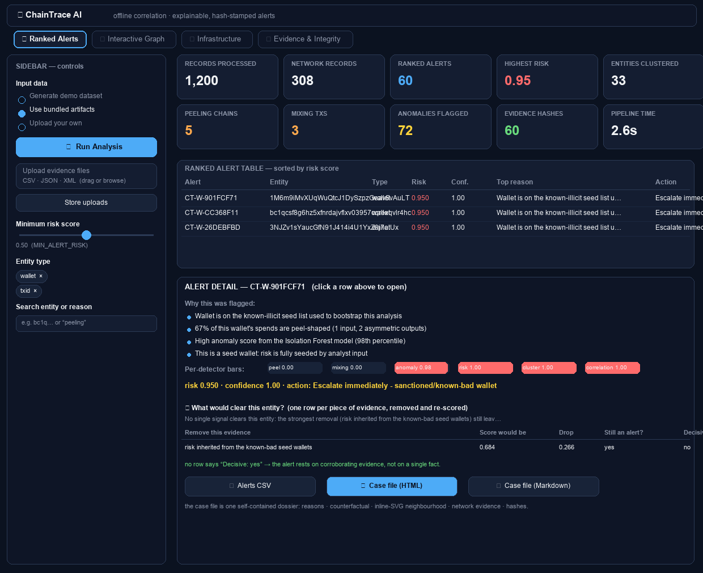
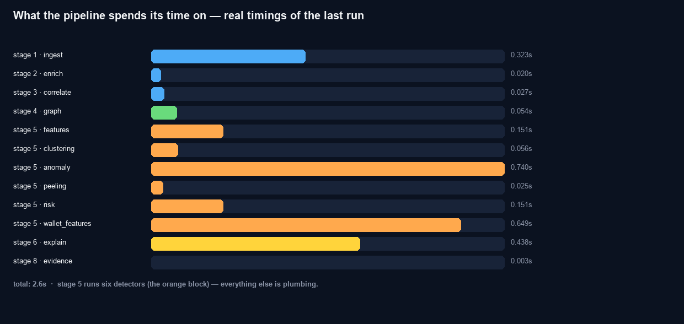
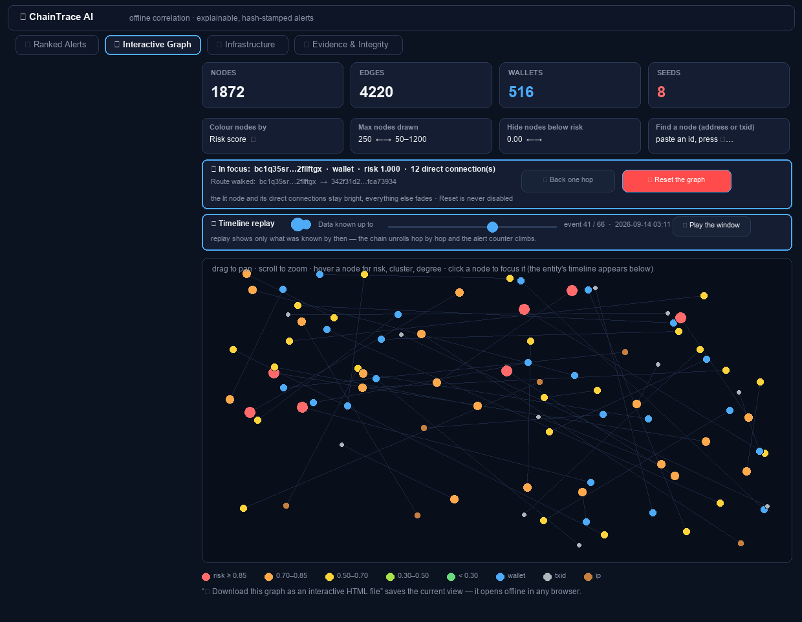
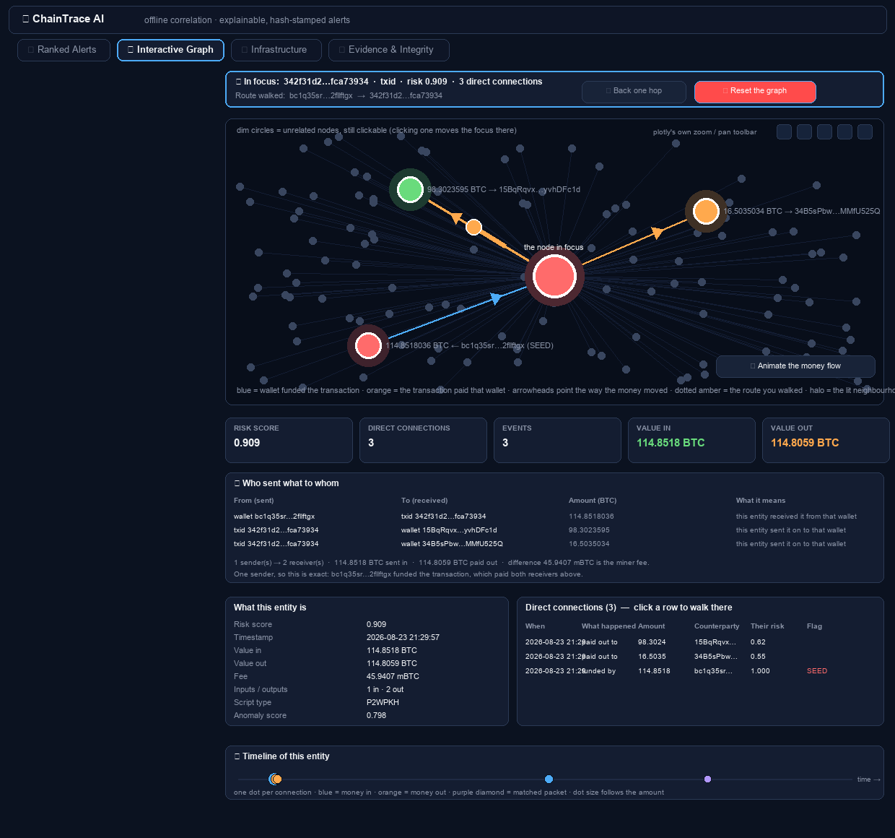
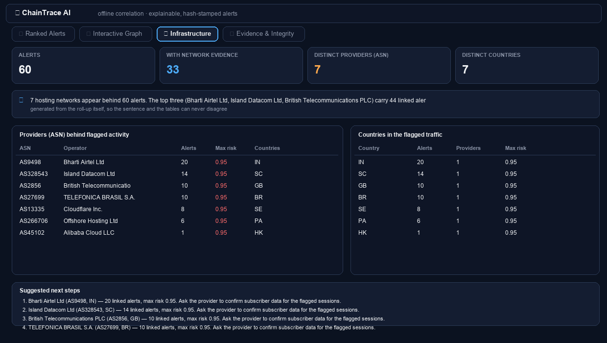
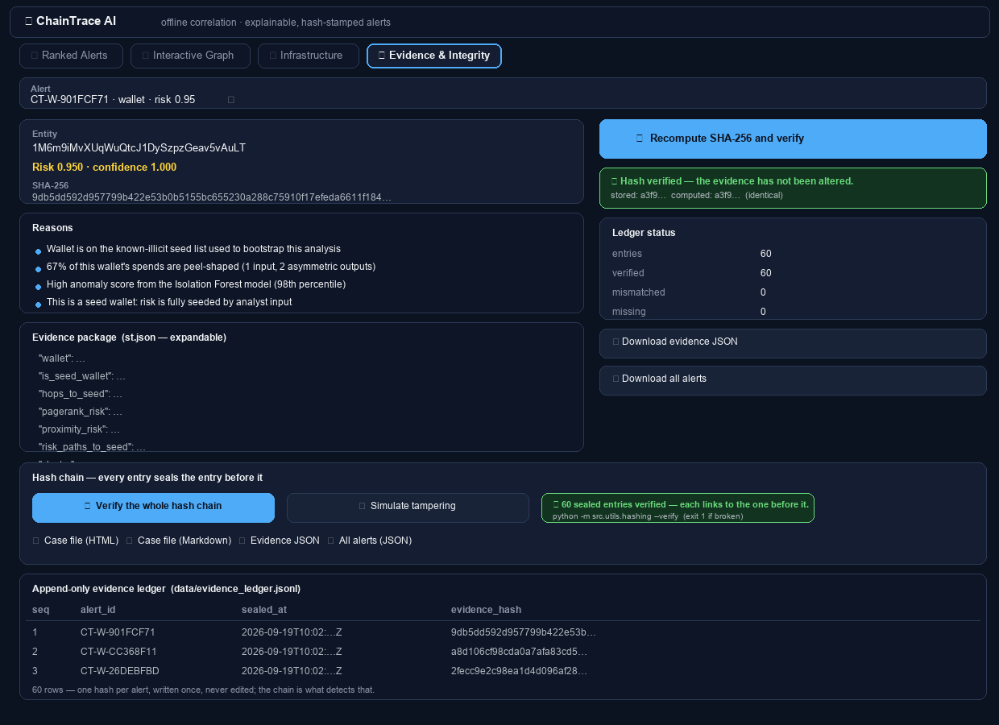
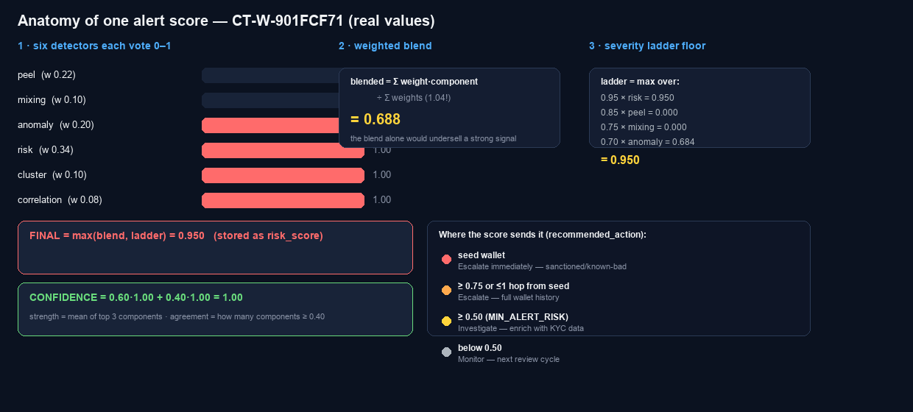
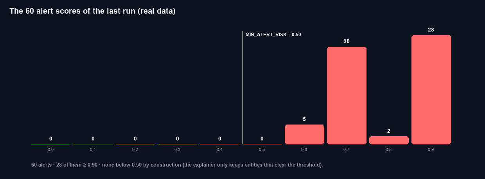

# Part 11 — The Button-by-Button Tutorial (everything under the hood)

This is the tutorial for someone who has never opened the app. It covers **every button, every slider,
every number on the screen, and what the machine is doing behind each one** — written so a non-technical
person can follow along. Layouts are illustrated with rendered wireframes and real-data charts
(`docs/images/*.png`, one level below this file); ASCII snapshots are used where a picture adds nothing.
The images are regenerated from the latest artifacts with `python scripts/render_doc_visuals.py`, so
they always show the current run.

> Companion reading: Part 8 covers installation; this part assumes the app is already running.
> All demo numbers below are from a real run of the bundled dataset (1,200 transactions, 516 wallets,
> 60 alerts). If your numbers differ slightly, that is normal — the dataset is seeded, but the top-6%
> anomaly cut can shift a few entities between runs.

---

## 11.0 Getting the screen up (60 seconds)

```bash
cd chaintrace-ai
docker compose up --build          # first time: ~10 min (installs + trains). Later: seconds.
```

Open **http://localhost:8501** in a browser. You should see:

```
┌──────────────────────────────────────────────────────────────────────────────┐
│ ▌🔗 ChainTrace AI                                              ≡ (sidebar)  │
│ ▌ Offline correlation of Bitcoin blockchain records with network metadata   │
│ ▌ four ML analyses · explainable, hash-stamped alerts                       │
│ ▌───────────────────────────────────────────────────────────────────────────│
│ ▌ [ 🎯 Ranked Alerts ] [ 🕸 Interactive Graph ] [ 🌐 Infrastructure ]      │
│ ▌ [ 🔒 Evidence & Integrity ]                                              │
└──────────────────────────────────────────────────────────────────────────────┘
```

Four tabs at the top, a dark sidebar on the left. That is the whole app — everything else is content.

**If the page is blank or says "No alerts match the current filters":** no analysis has run yet.
Go to the sidebar (next section) and press **▶ Run Analysis**.

---

## 11.1 The sidebar — every control explained

The sidebar is the **control room**. From top to bottom:

```
┌─ SIDEBAR ────────────────────────────────────────────┐
│ ### 🔗 ChainTrace AI                                 │
│ v1.0.0 · offline prototype                           │
│ ─────────────────────────────────                    │
│ ( API · live )        ← status pill                  │
│ API: http://127.0.0.1:8000                           │
│                                                      │
│ #### Run analysis                                    │
│ Input data                                           │
│   ○ Bundled synthetic sample                         │
│   ○ Uploaded files (data/raw)                        │
│   ○ Regenerate synthetic sample first                │
│ [ ▶ Run Analysis ]    ← the big button               │
│                                                      │
│ #### Upload evidence files                           │
│ [ drag-and-drop zone ]  CSV/JSON/JSONL/XML           │
│ [ Store uploads ]                                    │
│                                                      │
│ ─────────────────────────────────                    │
│ #### Filters                                         │
│ Minimum risk score   ────●──────── 0.50              │
│ Entity type          [x] wallet  [x] txid            │
│ Search entity or reason  [___________]               │
│ ─────────────────────────────────                    │
│ Every alert carries a plain-English explanation      │
│ and a SHA-256 evidence hash. Nothing in this         │
│ console talks to the internet.                       │
└──────────────────────────────────────────────────────┘
```

### The status pill — `( API · live )` vs `( artefacts · filesystem )`

This tiny badge answers a question you cannot otherwise see: **where did this screen's data come from?**

| Pill | Meaning | What to do |
|---|---|---|
| **API · live** (green) | The dashboard asked the FastAPI backend (port 8000) for its data and got an answer. This is the "full stack" state — the same state a judge sees with `docker compose up`. | Nothing. This is the good state. |
| **artefacts · filesystem** (yellow) | The API did not answer within 2.5 s, so the dashboard silently fell back to reading the result files from `data/artifacts/` directly. | Cosmetic only — every feature still works. If you want the green pill, start the API: `uvicorn src.api.main:app --port 8000`. |

Why this exists at all: a demo must not die because one process is down. The dashboard is a *client*
with a parachute — it prefers the live API but always has the files as a second source. (This dual
source is also why the Evidence tab merges full alert packages from the artefact file; see Part 7.5.)

### Input data — the three radio choices

This decides **which pile of files the pipeline eats** when you press Run Analysis:

| Choice | What actually happens under the hood |
|---|---|
| **Bundled synthetic sample** | Runs the 8-stage pipeline over `data/synthetic/` — the 1,200-transaction demo dataset with the planted crimes. This is the option for a demo. |
| **Uploaded files (data/raw)** | Uses the **most recent** `data/raw/upload_<timestamp>/` folder (created by the uploader below). Nothing in the pipeline changes — same stages, same models, your data. |
| **Regenerate synthetic sample first** | Calls the dataset generator (`generate_dataset`) first, then analyses the fresh sample. Use this to prove the whole system is reproducible live: new data in, new alerts out, in seconds. |

### ▶ Run Analysis — the big button

What one click actually triggers, in order:

1. A **status box** opens with a progress bar and a live ticker: `stage 1/8 - ingest`, `stage 2/8 - enrich`, …
2. The full 8-stage pipeline runs **inside the app process** (`run_full_pipeline` with a progress callback). It does **not** need the API — this is why the button works even in the yellow-pill state.
3. When it finishes (~3 s on a laptop once the models exist), the box turns green with a summary: *"Sample analysis complete in 2.6s - 1200 transactions, 60 alerts"*.
4. Streamlit's caches are cleared and the page re-renders with the fresh numbers.

**What you will see tick past** (and who built each stage — the same mapping shown in Tab 1):

| Stage ticker | Stage name | What it is doing | Owner |
|---|---|---|---|
| 1/8 | ingest | parse CSV/JSON/XML into one schema, drop malformed rows | Person E |
| 2/8 | enrich | attach country/ASN to every IP from the offline table | Person E |
| 3/8 | correlate | join network records to transactions (TXID or ±90 s window) | Person E |
| 4/8 | graph | build the wallet↔transaction↔IP graph (~1,872 nodes) | Person E |
| 5/8 | ml | the four analyses: features → clustering → anomaly → peeling → risk | Persons A & B |
| 6/8 | explain | build the ranked, explained, hash-stamped alerts | Persons A & B |
| 7/8 | serve | write artefacts the API and dashboard read | Person C |
| 8/8 | evidence | seal every alert with SHA-256 into the ledger | Person F |

> **Safe to press repeatedly.** The pipeline always rebuilds its artefacts from scratch into
> `data/artifacts/`; it never appends or corrupts. The only caveat: don't run two analyses at the same
> instant from two browser tabs — the second overwrite wins (and, being deterministic, they are identical
> for the same input anyway).

### Upload evidence files + **Store uploads**

The drop zone accepts `csv / json / jsonl / xml`, multiple files at once. Pressing **Store uploads**
writes them to a fresh folder `data/raw/upload_<YYYYMMDD_HHMMSS>/` and confirms:

```
✔ Stored 3 file(s) in data/raw/upload_20260920_141210
```

Nothing is analysed yet — storing is step 1. To analyse, either switch the radio to *Uploaded files* and
press **▶ Run Analysis**, or call the API directly (`POST /upload`, then `POST /run` with
`use_uploaded_files=true`). The parser auto-detects whether a file holds transactions or network records
**by its columns, not its name**, and the pipeline de-duplicates by TXID — in testing, the same 60
transactions uploaded as CSV+JSON+XML were correctly merged into 60, not 180.

### Filters — the three view controls

These change **what you see**, never what the pipeline computed:

| Control | What it does | Under the hood |
|---|---|---|
| **Minimum risk score** (slider, default 0.50) | Hides alerts below the chosen risk. Slide to 0.9 to see only the serious ones. | A Python list filter over the loaded alerts; the pipeline's own floor is `MIN_ALERT_RISK = 0.50`, so nothing below 0.50 exists to hide. |
| **Entity type** (wallet / txid checkboxes) | Show only wallet alerts, only transaction alerts, or both. | Another list filter on `entity_type`. |
| **Search entity or reason** (text box) | Type "peel", "seed", a txid fragment, a country code — the table shrinks live. | Case-insensitive substring match against the entity id **and every reason line** of every alert. |

---

## 11.2 Tab 1 — 🎯 Ranked Alerts, top to bottom

This is the screen an investigator opens first: *what matters, right now, and why?*

### The ten metric tiles

```
┌ Records ──┐┌ Network ──┐┌ Ranked ───┐┌ Highest ──┐┌ Entities ─┐
│ processed ││ records   ││ alerts    ││ risk      ││ clustered │
│   1,200   ││   308     ││   60      ││  0.95     ││   32      │
└───────────┘└───────────┘└───────────┘└───────────┘└───────────┘
┌ Peeling ──┐┌ Mixing ───┐┌ Anomalies ┐┌ Evidence ─┐┌ Pipeline ─┐
│ chains    ││ txs       ││ flagged   ││ hashes    ││ time      │
│    5      ││    3      ││   72      ││   60      ││  2.6s     │
└───────────┘└───────────┘└───────────┘└───────────┘└───────────┘
```

What each tile means and where the number comes from:

| # | Tile | Plain meaning | Under the hood |
|---|---|---|---|
| 1 | **Records processed** | How many transactions were ingested and analysed. | `pipeline_summary.json → counts.transactions`. Deduplicated by TXID in stage 1. |
| 2 | **Network records** | How many network-metadata rows (IP sightings) were ingested. | `counts.network_records`. These are the raw material for stage 3. |
| 3 | **Ranked alerts** | The number of findings that made the final list. | Length of the ranked list — capped at `MAX_ALERTS = 60`. |
| 4 | **Highest risk** | The worst risk score on the board (0.95 = the seed-wallet rung of the severity ladder). | `max(alert.risk_score)`. |
| 5 | **Entities clustered** | How many ownership groups the clustering stage found. | `counts.clusters` = 32 in the demo (17 common-input + 15 Louvain — see Part 4). |
| 6 | **Peeling chains** | Distinct laundering chains detected by the chain-walker. | `counts.peel_chains` = 5, matching the 5 planted chains (validated: recall 1.00, precision 1.00). |
| 7 | **Mixing txs** | Transactions with a CoinJoin shape. | `counts.mixing_transactions` = 3, matching the 3 planted (precision 1.00, zero false positives). |
| 8 | **Anomalies flagged** | Transactions in the top ~6% of statistical weirdness. | The IsolationForest+LOF flag at quantile 0.94 → 72 of 1,200. |
| 9 | **Evidence hashes** | How many alerts carry a SHA-256 evidence stamp. | Equals the alert count (60) — every alert is sealed, no exceptions. |
| 10 | **Pipeline time** | How long the last full analysis took. | `summary.duration_seconds` — ~2.6 s on the bundled dataset (plus ~4 s to generate the data and train the models from scratch). |

These tiles are the **health check of the whole system**. If you ever press Run Analysis and see
`Records processed: 0` or `Ranked alerts: 0`, something upstream failed — check
`data/artifacts/pipeline_summary.json` for the failing stage.

### The ranked table

```
Alert         Entity                    Type    Risk        Conf  Top reason
CT-W-1E60A69D bc1qxu2npz5rjkhmf06t2t…  wallet  ▓▓▓▓▓▓▓▓▓░ .950  1.000  Wallet is on the known-illicit seed list
CT-W-60FE654F 1pXntRRjsuiAY39ZeNx7xw…  wallet  ▓▓▓▓▓▓▓▓▓░ .950  1.000  Wallet is on the known-illicit seed list
CT-T-9F2C11A4 9f2c11a4…                txid    ▓▓▓▓▓▓▓▓░░ .850  0.997  Participates in peeling chain PC-01 …
…             …                        …       …           …     …      …
```

- **Risk** is drawn as a progress bar (0→1). It is the blended, ladder-floored severity score — the
  number the ranking sorts by (Part 6 explains the maths).
- **Confidence** is a *different* number: how many independent detectors agree (Part 6.4). A 0.9-risk /
  0.35-confidence row means "one weak signal says something is off"; 0.9/1.0 means "five detectors agree".
- The table is **diversity-guaranteed**: the 3 CoinJoin alerts and the anomaly-only alerts are guaranteed
  slots, so peeling hops cannot crowd out a rare finding (Part 6.7).

Click any row (or use the **Select an alert to open the evidence** dropdown just below) and the detail
card opens.

### The alert detail card

```
┌─ Detail ────────────────────────────────────────────────────┐
│ (risk 0.95) (confidence 1.00)                               │
│ WALLET                                                      │
│ bc1qxu2npz5rjkhmf06t2t9c0lfwasasqaj2yuknms                  │
│ Recommended action: Escalate immediately -                  │
│   sanctioned/known-bad wallet                               │
│                                                             │
│ Why this was flagged                                        │
│ • Wallet is on the known-illicit seed list                  │
│ • 2 transactions with anomalous structure (99th percentile) │
│ • The ownership cluster contains a wallet that is already   │
│   high-risk, so the whole entity is treated as exposed      │
│ Explanation method: importance_surrogate                    │
│                                                             │
│ Evidence strength by detector   Feature contributions       │
│  risk        ▇▇▇▇▇▇▇▇▇▇ 1.00     risk_pagerank   ▇▇▇▇ 0.36  │
│  anomaly     ▇▇▇▇▇▇▇▇▇░ 0.99     peel_chain_len  ▇▇▇  0.23  │
│  cluster     ▇▇▇▇▇▇▇▇▇▇ 1.00     out_degree      ▇▇   0.16  │
│  peel        ▇▇▇▇▇▇▇▇▇░ 0.92     n_txs           ▇▇   0.13  │
│  correlation ▇▇▇▇▇▇▇▇▇▇ 1.00     pagerank        ▇▇   0.11  │
│  mixing      ░░░░░░░░░░ 0.00                                 │
└─────────────────────────────────────────────────────────────┘
```

**"Why this was flagged"** — the reasons are written by templates filled with the *actual evidence*, not
generic labels: *"Participates in peeling chain PC-01 of length 8 hops (hop 1)"*, *"3 network record(s)
correlated with this transaction from NL, SC (best confidence 1.00 via txid_exact)"*. Every claim in a
reason is backed by a field in the evidence package (Tab 3 shows it raw).

**"Explanation method: importance_surrogate"** — this label is an honesty feature. It tells you which
explainer produced the feature bars: the default importance surrogate, or real KernelSHAP when the
optional `shap` package is installed (`docker compose build --build-arg INSTALL_SHAP=1`). The alert never
claims SHAP when SHAP did not run.

**"Evidence strength by detector"** — the six bars are the six score components, one per detector family:

| Bar | Detector family | What a high bar means |
|---|---|---|
| `risk` | risk propagation | close to a known-bad seed wallet |
| `peel` | peeling-chain walker | sits on a laundering chain (value decays with hop position) |
| `mixing` | CoinJoin shape detector | the transaction looks like a collaborative mix |
| `anomaly` | IsolationForest + LOF | statistically unlike its peers |
| `cluster` | entity clustering | its ownership group is tainted (0.00 when the group collapsed — deliberate) |
| `correlation` | network correlator | network metadata ties it to an IP/time window |

A bar at 0.00 is **not an error** — it means that detector found nothing for this entity. (E.g. `mixing:
0.00` on a wallet alert is normal; mixes are transactions. And since the collapse-guard fix, a wallet in
the 347-wallet collapsed component *deliberately* earns `cluster: 0.00` — the alert says so in words.)

**"Feature contributions"** — the model's own accounting of *which input numbers* pushed the score. The
contributions always sum to 1.0 (asserted by the test suite), so read them as a percentage breakdown:
"36% of this decision was `risk_pagerank`, 23% was `peel_chain_length`…". Each bar also shows the raw
feature value in the table below the chart.

**Recommended action** — one of four fixed verdicts (Part 6.5): *Escalate immediately* (seed wallet),
*Escalate* (score ≥ 0.75 or ≤ 1 hop from a seed), *Investigate* (≥ 0.50), *Monitor* (below, kept only in
the diversity slots). This is the sentence a busy analyst reads first.

### 🔄 What would clear this entity? (the counterfactual)

The three sections above answer *"why is this flagged?"*. This one answers the next question an
investigator actually asks: **"what would I have to disprove to close the case?"**

```
┌ Remove this evidence ──────────────────────┬ Score would be ┬ Drop ┬ Still an alert? ┬ Decisive? ┐
│ risk inherited from the known-bad seed ... │      0.684     │ 0.266│      yes        │    no     │
└────────────────────────────────────────────┴────────────────┴──────┴─────────────────┴───────────┘
```

Each row removes exactly one piece of evidence and re-scores the alert without it:

| Column | Meaning |
|---|---|
| **Remove this evidence** | which of the six components is taken away (peel, mixing, anomaly, risk, cluster, correlation) |
| **Score would be** | the blended score if only that evidence disappeared — the ladder floor is dropped too, because that floor was earned by that evidence |
| **Drop** | how much the score falls (score − score-without) |
| **Still an alert?** | whether the result stays above the 0.50 alert threshold |
| **Decisive?** | **yes** only when removing that one thing takes the entity off the list entirely — i.e. *disprove this and the alert dies* |

If any row says **Decisive: yes**, the tab shows a red warning naming the one thing to attack. If every
row is non-decisive (the common case, as above), you get a green note: *"No single piece of evidence
decides this alert — two or more independent signals have to fall away."* That is a real strength claim
about the individual alert, not marketing: the counterfactuals are computed by re-running the scoring
function with one component ablated, and they are **inside the SHA-256 sealed package**, so they cannot be
edited after the fact either.

> **Honest limit.** A counterfactual is arithmetic on the *model's own evidence*, not proof about the
> world. "Remove the seed inheritance and it drops to 0.68" means the alert leans on more than the seed
> list; it does not mean the wallet is innocent. Read it as *where to dig*, never as a verdict.

### Pipeline stage timings (expander)

Opens a table of the eight stages with their durations and details, annotated with the owner mapping
("1–3 Data (Person E), 4 Data & Graph (Person E), 5–6 AI/ML (Persons A & B), 7 Dashboard (Person C),
8 Integration (Person F)"). Two uses: a judge can see the system is genuinely staged end-to-end, and a
developer can see *which* stage got slow after a tuning change.

### The three downloads — table, dossier, dossier



*The whole of Tab 1 in one picture: sidebar controls on the left, the ten metric tiles,
the ranked table and the detail card. Every label above matches the real app.*

**⬇ Alerts CSV** exports the *currently filtered* alert list — the same rows you see, same order — for
pasting into a report or a spreadsheet.

**⬇ Case file (HTML)** and **⬇ Case file (Markdown)** are the deliverable an investigator files. Both
build a self-contained dossier for the alert you have selected:

| Section | What it contains |
|---|---|
| Header | alert id, entity, risk, confidence, recommended action, generation timestamp |
| Why this was flagged | the full reason list, in detector order |
| What would clear this entity | the counterfactual summary and the ablation table |
| Neighbourhood | the alert's surroundings drawn as an inline SVG (works with no internet at all) |
| Financials / cluster / peel chain | totals, counterparty count, first/last seen, cluster method and size, chain id, hop, value moved, asymmetry |
| Network evidence | every correlated packet with country, ASN, operator, match method, confidence and Δ time |
| Related transactions | the transactions the evidence points at, with role and amount |
| Integrity | the alert's SHA-256 and the ledger's chain status, plus the exact commands to re-verify |

Open the `.html` in any browser (or attach it to a report); the `.md` is the same content for a ticket
or a wiki. Neither file talks to the network — no CDN, no fonts, no images to fetch.


*The whole of Tab 1 in one picture: sidebar controls on the left, the ten metric tiles,
the ranked table and the detail card. Every label above matches the real app.*

**⬇ Download CSV** (bottom of Tab 1) exports the *currently filtered* alert list — the same rows you see,
same order — for pasting into a report or a spreadsheet.



*Where the "Pipeline time" tile comes from: stage 5 runs all six detectors (the orange block);
everything else is plumbing. Your numbers will differ slightly by machine.*

---

# Part 11 (continued) — Tabs 2–4, every number, and one transaction's journey

## 11.3 Tab 2 — 🕸 Interactive Graph

This tab answers a different question than Tab 1. Tab 1 says *"who is risky"*; the graph says
*"how did risk get there"*. Money leaves footprints: every transaction is an arrow from spenders
to receivers, and the graph is all 1,872 footprints drawn at once.



### The four tiles at the top

| Tile | Meaning | Where it comes from |
|---|---|---|
| **Nodes** | How many circles are in the picture (wallets + transactions + IP addresses) | stage 4 detail `nodes` |
| **Edges** | How many arrows connect them (one per transaction input/output link) | stage 4 detail `edges` |
| **Wallets** | How many of the nodes are addresses people own | stage 4 detail `wallets` |
| **Seeds** | The known-bad wallets the analysis starts from | stage 4 detail `seed_wallets` |

### The five controls, one by one

**Colour nodes by** — a dropdown with three choices:

* **Risk score** (default) — every node is painted by its risk number:
  green < 0.30, lime 0.30–0.50, yellow 0.50–0.70, orange 0.70–0.85, red ≥ 0.85.
  This is the fastest way to see the "heat map" of the network.
* **Ownership cluster** — nodes are painted by which cluster they belong to (ten colours,
  reused cyclically; grey = no cluster). Use this to *see* the entity clustering from Part 4:
  a blob of one colour is one suspected owner.
* **Node type** — blue = wallet, grey = transaction, orange = IP address. Use this when you
  want the plumbing visible instead of the verdicts.

**Max nodes drawn** (slider 50–1200, default 250) — a safety valve. 1,872 nodes at once is
hair, not information. The tab keeps the *most important* nodes up to this limit, where
"important" means: highest risk first, then highest number of connections. Lower it to 50
and you get a clean "most wanted" picture; raise it to see the crowd.

**Hide nodes below risk** (slider 0.00–1.00, default 0.00) — a second filter. At 0.00
nothing is hidden; drag it to 0.7 and only orange-and-red nodes survive. Combined with
Max nodes drawn you can say things like *"show me only the top 50 nodes above 0.7"*.

**Find a node** (text box) — paste any address or txid (a full one, or just the first few
characters) and it becomes the **focus** — see 11.3b below. Once something is in focus the
box stops narrowing the picture (it has done its job: it chose the focus), so the rest of the
graph stays on screen, faded, as context.

**⏱ Timeline replay** (toggle, off by default) — turns the tab into a *replay of the collection window,
scrubbed by hand inside the picture itself*.

Switch it on and the chart becomes one self-contained time view: the snapshots are **frames in the
figure** and the control is a **timeline slider under the chart**. Dragging it (or clicking anywhere on
the strip) moves the window **in place** — no script rerun, no chart re-render, no page reload, nothing
else on the page touched. That is the whole point of building it this way: an earlier version drove the
same idea from a Streamlit slider, and every step of a drag was a rerun that redrew a couple of hundred
nodes, which read as the page reloading. While the replay is on, the *click any node to focus it* hint
above the picture is hidden on purpose: a tap here does not move the focus, and the console should not
advertise a gesture the chart cannot honour. Switch the toggle off to get it back.

Every node is visible from its **first transaction**, computed from the earliest edge that touches it
(`src/utils/helpers.first_seen_by_edge`). Scrub left and nodes and arrows disappear — you are looking at
the graph as it existed then, not a filter over today's picture — and scrub right to watch it fill back
up. Two things make this worth a demo:

* **Peeling unrolls at your pace.** Drag from the left end: the chain appears hop by hop and the risky
  node colours spread outward from the seeds, because risk propagation is a per-hop process and this is
  that process drawn. Nothing plays on its own and nothing is in a hurry — the bundled window is 1,282
dated events, and the auto-play loop the first version shipped walked all of them in about three seconds,
  which could be neither read nor stopped.
* **The alert counter climbs.** The card in the corner counts how many of the 60 alerts exist by the
  moment on screen — *"data known up to 2026-09-21 23:22:52 · 250 of 250 nodes · 60 of 60 alerts exist by
  then"* at the end, and a handful near the start. It counts every entity known by then, not just the
  nodes the *Max nodes drawn* budget happened to keep, so the trend is real and not an artefact of the
  node cap.

The slider is labelled every fourth step ("08-24", "08-28", …) so the scale stays readable, and the card
always names the exact moment, the node count and the alert count. Two deliberate limits: **the replay
draws the whole window** (a focus set on the graph tab is paused while it is on — see the header line),
and the node budget and the layout are the *final* picture's, so nodes fade in on the spot they will keep
instead of the graph reshuffling under the cursor. Replay is a *view*, like everything else in this tab:
it never changes the artefacts, and switching the toggle off returns you to the full 30-day picture.

### What the picture itself does

* **Hover** any node: a tooltip shows its type, id, risk score, cluster id, connection count,
  and a `SEED WALLET` badge if it is one of the known-bad starting points.
* **Drag** to pan, and zoom from the chart's toolbar (top-right, on hover) — a wheel over a 2D
  Streamlit chart scrolls the page rather than the plot, on purpose. **Double-click** resets the view.
  The layout is computed by a "spring" simulation
  (connected nodes pull together, unconnected ones push apart), run with a fixed random seed —
  so the picture is *the same every run*, which makes screenshots comparable.
* **Click** a node: it goes into **focus** (11.3b) — that node and its direct connections stay
  lit behind a coloured halo, everything else fades, and the node's own timeline appears below the chart.
* **Follow the arrowheads.** Every lit line carries one arrow, and the arrow always points the way
  the coin moved: `wallet → transaction` (blue) means that wallet spent *into* the transaction,
  `transaction → wallet` (orange) means the transaction paid *out* to that wallet, `IP → transaction`
  (purple) means a network packet was matched to it and no coin moved at all. A plain line says
  "these two touched" and nothing more — the arrow says who paid whom. Only lit edges get arrows;
  a few hundred arrowheads on the faded background would be texture, not evidence.
* **Press ▶ Animate the money flow** (bottom-right of the picture, kept clear of the zoom/pan toolbar
  that plotly draws in the top-right corner) and watch the value travel: one coin
  leaves each sender, rides along its line and lands on the receiver, dragging a comet tail behind it
  (11.3c). The coins are sized by the amount and coloured by the direction, so the biggest transfer in
  the neighbourhood is also the most obvious dot on the move.
* **⬇ Download … as an interactive HTML file** — saves exactly what you see as a
  self-contained file that opens in any browser, offline, with zoom and hover intact.
  Zero internet requests — one of the project's promises, kept even in the export. While
  something is in focus, the export contains **just that neighbourhood**, which is what you
  actually want to attach to a report.

---

## 11.3b Focus mode — tap a node, walk the ladder, read its timeline

1,872 nodes at one intensity is a hairball. Focus mode is the cure: **one entity at a time,
with only its direct connections at full strength.**



### The three ways to choose the node in focus

| Way | How | When to use it |
|---|---|---|
| **Tap it on the chart** | Click any node — lit or faded | Fastest if your click lands; the chart must deliver the click to the app (see the honesty box) |
| **Find a node** | Type an address or txid into the text box and press Enter | When you have an id in hand — this is how you follow up a ranked alert |
| **Hop to a connected node** | Pick from the dropdown that appears above the chart | The deterministic route: it lists exactly the direct connections, highest risk first, with a `SEED` / `mixing` tag |
| **Click a row of the connections table** | Click any row in *Direct connections* | The same walk as a tap, straight from the evidence list |

### What the picture shows once something is in focus

The graph is no longer "everything, equally". It becomes a picture with a subject:

| On screen | What it means |
|---|---|
| Big circle with a white ring | **The node in focus** (the head of the ladder) |
| Coloured circles with white rings, inside a soft **coloured halo** | Its **direct connections** — one edge away. This is the only neighbourhood allowed to stay bright, and the halo is what makes it readable at a glance: without it, "fifty coloured dots at 0.32 opacity" and "one brighter dot" look almost the same on a laptop screen |
| Circles with an **amber ring** and an amber halo | **Breadcrumbs**: nodes you walked through to get here — the route, not the current neighbourhood |
| Faint grey circles | Everything else, drawn at 32% opacity. Still hoverable and still clickable (clicking one moves the focus there), but visibly *not* evidence |
| Thick blue arrows | `wallet → transaction` — that wallet **funded** the transaction. The arrowhead sits between the two nodes and points *from wallet to transaction* |
| Thick orange arrows | `transaction → wallet` — the transaction **paid** that wallet (arrowhead points from the transaction to the wallet) |
| Thick purple arrows | `IP → transaction` — a matched network packet; the arrow points at the transaction, and no coin moved |
| Dotted amber line | **The route you walked** (your breadcrumbs, joined up) |
| Thin dark lines | All the unrelated edges, faded to texture |
| **▶ Animate the money flow** (button) | Plays the flow animation for every lit hop — see 11.3c |

A direct edge is something you can point at; a two-hop "probably related" is a hunch. The fade is
there to keep the hunch off the screen until you go and look at it — click the neighbour and *it*
becomes the subject, one rung further up the ladder.

### 11.3c ▶ Animate the money flow — see the value move, not just the link

A line says two entities are connected. An arrowhead says which way the coin went. The animation is the
third step: **press ▶ Animate the money flow** in the chart's bottom-right corner and every lit hop sends a
coin from its sender to its receiver. That corner is not an accident: the control used to sit *above* the
plot, which is exactly where plotly draws its own zoom / pan / box-select / reset toolbar as soon as the
cursor is over the chart, so the two sets of controls landed on the same pixels and the play button won
that fight only until you moved the mouse. The bottom-right corner is free in every view of this chart.

* **A coin per hop, sender → receiver.** The coin starts on the *source* of the edge (the wallet for a
  blue edge, the transaction for an orange one, the IP for a purple one) and lands on the target. It
  cannot start anywhere else: the graph's edge direction *is* the money direction (stage 4 keeps it
  that way), which is the same fact the arrowheads and the `From (sent) → To (received)` table use.
* **A comet tail traces the line.** The tail spans the last 28% of the ride in the hop's own colour, so
  the movement reads as travel *along an existing edge* rather than as a new kind of link appearing.
* **Coin size follows the amount** (square root of the hop's share of the biggest hop in that
  neighbourhood), so a 98 BTC payout is visibly fatter than a 0.001 BTC one without the small hops
  disappearing. A network correlation has no amount, so its coin is a plain size — no coin moved, a
  packet did.
* **Only lit hops are animated.** Motion on three hundred faded edges would be decoration; motion on the
  twenty edges you are actually reading is evidence. The animation is also built *only* when something is
  lit: the whole-graph view and the timeline replay (see the seek bar above) each draw one static picture,
  because a hundred half-faded coins is not evidence either.
* **It is a one-shot play, not a loop**, and it is a frame animation (`plotly` frames), which is why it
  works with no internet connection and no animation library: the movement is data in the figure, not
  script in the page.
* **Reproducible by construction.** The frames are computed from node positions that are already pinned
  for the session (`_stable_layout`), so the same walk always produces the same animation. A test asserts
  the frames exist, that they are 12, and that a finished coin is sitting exactly on a node — never in
  empty space.

### Walking the ladder (and getting back)

* **Click a lit neighbour** (or pick it in **Hop to a connected node**, or click its row) → it becomes
  the new focus and the edge you used is remembered in amber. Repeat to walk a peeling chain hop by hop.
* **⬅ Back one hop** → step back down the ladder. The trail is remembered, so you can retrace a walk
  you took ten clicks ago.
* **Click a breadcrumb** in the chart → walk straight back to that node instead of looping.
* **🔄 Reset the graph** → everything returns to one intensity, the search box empties, and the chart
  comes back with nothing selected. It sits in the top-right of the focus row, is highlighted as the
  primary action, and is **never disabled** — press it at any time, including when nothing is focused, to
  clear a selection that appears to be stuck.
* The ladder keeps the last **12 hops**; the header line always shows **Route walked:** so far.

The focus row above the chart is always on screen:

```
🔎 In focus: bc1q35srz6a27ps6m0l89jweznt83n2sqn2fllftgx - wallet, risk 1.000, 12 direct connection(s)
Route walked (money trail): bc1q35sr…2fllftgx  -114.8518 BTC→  342f31d2…fca73934  -98.3024 BTC→  15BqRqvx…yvhDFc1d
                                     [ ⬅ Back one hop ]   [ 🔄 Reset the graph ]
```

The route line is the **dotted amber line on the chart with the money put back on it**: one amount
per hop, so a walk reads as value moving from entity to entity rather than as a list of ids. It uses a
single unit for the whole trail (chosen from the biggest hop) — `format_btc` would otherwise print 1.0
BTC and 900 mBTC side by side and make the reader do arithmetic to see which hop was larger. A hop that
is a network correlation has no amount and says so (`-time_window→`) instead of pretending money moved.

When nothing is focused, the first line reads *"Nothing in focus"* and **Back one hop** is greyed out —
**Reset the graph** stays available, because a selection can be sitting in the chart even when the app has
not acted on it yet.

Two details that make the walk usable rather than dizzying:

* **The layout does not jump.** Node positions are remembered for your session: an existing node keeps
  the spot it already had, and a node appearing for the first time is dropped next to neighbours that are
  already placed. A fresh spring layout on a different node set would move *everything* under your cursor
  on every click (`_stable_layout`).
* **Your focus survives the filters.** The focused node and its direct connections are always drawn,
  whatever *Max nodes drawn*, *Hide nodes below risk* or the replay scrubber say.

### The focus panel (what appears under the chart)

| Element | What it tells you |
|---|---|
| **Tile row** | Risk score · Direct connections · Events · **Received / Spent** (wallet) or **Value in / out** (transaction) or **Country / Correlated events** (IP) · Active window · Counterparties ≥ 0.5 risk |
| **What this entity is** | The node's own attributes in plain words: role (seed / mixing), risk, cluster, totals, first/last seen, wallet lifetime, peel and anomaly scores — no raw JSON |
| **Alerts that mention it** | The ranked alerts whose evidence contains this id, with their first reason |
| **Direct connections** | Every edge of this node, in time order: step, when, what happened (*received / spent / funded by / paid out to / packet from*), amount in BTC, counterparty, its type, **its** risk, and a `SEED` / `mixing` flag |
| **💸 Who sent what to whom** | Every coin movement written as an arrow in words: **From (sent) → To (received)**, amount, what that means for the focused entity, and when. This is the table to screenshot for a report — it answers "who sent this, who received it" without decoding a direction word |
| **🕒 Timeline of this entity** | The same rows as a time rail: one dot per connection, blue = money in, orange = money out, purple diamond = a matched packet. Dot **size** follows the amount, so the big move is the obvious one. Events that share an instant are nudged apart so a fan-in reads as four events, not one |

### 💸 Who sent what to whom — reading the money-flow table

The *Direct connections* table tells you what each edge **is**; the money-flow table tells you who
**paid whom**, with the sender always in the left column. Three shapes come out of it:

**1. A wallet in focus.** One row per movement of *that wallet*: rows where it is the sender are
labelled `sent`, rows where it is the receiver are `received`.

| From (sent) | To (received) | Amount (BTC) | What it means |
|---|---|---|---|
| `wallet bc1q35sr…2fllftgx` | `txid 342f31d2…fca73934` | 114.8518036 | this entity sent it into the transaction |
| `txid 5e05cd8c…ef89a5a1` | `wallet bc1q35sr…2fllftgx` | 0.60583201 | the transaction paid this entity |

**2. A transaction with one sender.** Bitcoin's own rule is that a transaction links its inputs and
outputs only as a *pool* — so with a single input the mapping really is exact, and the panel says so.
Focusing the transaction `342f31d2…fca73934` prints:

> 1 sender(s) → 2 receiver(s) · 114.8518 BTC sent in · 114.8059 BTC paid out · difference 45.9407 mBTC is the miner fee.
>
> One sender, so this is exact: `bc1q35sr…2fllftgx` sent 114.8518 BTC in, and the transaction paid out — `15BqRqvx…yvhDFc1d` got 98.3024 BTC, `34B5sPbw…MMfU525Q` got 16.5035 BTC.

The "value in ≠ value out" gap is stated on purpose: the difference *is* the miner fee
(114.8518036 − 114.8058631 = 0.0459405 BTC), and a console that hid it would look like it had lost money.

**3. A transaction with several senders.** Most transactions in the sample (358 of 1,200) are like this.
The rows still show every sender and every receiver with amounts, but the panel refuses to invent a
pairing:

> 2 senders for 2 receiver(s). Bitcoin links inputs and outputs only as a pool, so this transaction is
> shown as a pool: the total in equals the total out plus the fee, but no honest tool can say which
> sender paid which receiver without the UTXO-level matching that this prototype does not model.

That sentence is the honest answer to a fair question. A tool that drew two senders → two receivers as a
crossed pair would be making up evidence; showing the pool is what a real analyst does at this stage.

Two worked examples from the shipped sample:

* Focus the seed wallet `bc1q35sr…2fllftgx` → *Received 10.9385 BTC*, *Spent 120.7541 BTC*, 12 events,
  an active window of 602.8 h, and a timeline that shows one large outbound move at the start followed by
  eleven smaller spends — the shape of a wallet that was funded once and drained in slices.
* Focus a peeling-chain transaction → *funded by* one wallet, *paid out to* two, at the same instant: the
  1-input / 2-output asymmetry that makes the chain walkable, visible in a single row of the table.

The timeline numbers are not decoration: a wallet's *Received*/*Spent* totals are computed from the
same edges the graph draws, and a test asserts they match the wallet's own stored totals — a
mismatch would mean the picture and the arithmetic disagree.

> **Honest box — why a chart tap sometimes seems to do nothing.**
> The chart reports selections through Streamlit's plotly binding, and that binding is
> version-dependent: in the Streamlit build tested here (1.38), a **box or lasso drag** and the controls
> in the focus row always reach the app, while a single point-click can be swallowed before it gets there
> (the app receives nothing, so nothing changes). Four things were done about it rather than pretending
> otherwise: the graph's edges are excluded from hit-testing (`hoverinfo="skip"`) so a click lands on the
> **node** and carries its id instead of hitting a coincident edge vertex (verified in a browser:
> `curve 6, customdata = <address>`); the click target was made to match the drawn dot (plotly's default
> hover/click radius is 20 px, while the dots the console draws have a radius of up to 25 px, so clicking
> the *outer ring of a big dot* resolved to nothing — reproduced in a browser: one 50 px dot focused at
> its centre and did nothing 28 px lower), and the chart now asks plotly for true point selection
> (`clickmode="event+select"`, `hoverdistance=32`) instead of relying on the frontend's defaults; the same
> walk is available from the dropdown and the connections table, which do not depend on chart hit-testing
> at all; and **🔄 Reset the graph** is always available to undo anything, including a click the app never
> received. If a tap does nothing in your browser, use **Find a node** and press **Reset the graph**
> first — the result is identical.
>
> When you need to know *which* of those two things happened, run the dashboard with
> `CHAINTRACE_FOCUS_DEBUG=1` and a **🐞 tap log** appears under the chart, one line per rerun:
> `sel=-` means the browser never sent a point selection (the tap was dropped before the app saw it, so
> no amount of focus logic could have helped), while `sel=<node> … handled=1` on the same node is the
> guard doing its job (that click was already acted on). Measured live in the browser with that log,
> clicking *the same dot* twice in a row produced `sel=-` once and `sel=<node>` once, with nothing
> different about the click; every drop happened while the chart was still freshly mounted, and the same
> click on the same dot landed once the page had settled. A dropped tap is a *browser-side* loss, which is
> exactly why the non-tap routes exist. See Part 10.

### Under the hood (30 seconds of honesty)

The graph you see is a *projection*: the full data structure is a directed multi-graph
(multi-edges allowed, arrows have direction), but the picture uses its undirected view for
positioning because spring layouts read better that way. Positions are cosmetic — the truth
lives in the edges, and the export keeps them all.

---

## 11.4 Tab 3 — 🌐 Infrastructure (where should we go next?)

This tab exists because of a practical fact: **wallets are cheap to abandon, infrastructure is not.**
A flagged address can be emptied and forgotten; the hosting provider, the ASN and the country behind the
traffic stay in place. So this tab aggregates every alert that carries network evidence by the provider
that carried it, and answers *"who do we talk to first?"*

```
┌ Alerts ──┐┌ With network ─┐┌ Distinct ───────┐┌ Distinct ────┐
│   60     ││ evidence: 33  ││ providers (ASN) ││ countries: 7 │
└──────────┘└───────────────┘└─────────────────┘└──────────────┘
7 hosting networks appear behind 60 alerts. The top three (Bharti Airtel Ltd, Island Datacom Ltd,
British Telecommunications PLC) carry 44 linked alerts between them - start the provider
conversation there.
```



### What each element does

**The four tiles** — total alerts, how many carry network evidence at all, how many distinct ASNs those
providers are, and how many countries. *"33 of 60 alerts have network backing"* is itself a finding: the
rest are blockchain-only, and the tab says so rather than inventing a provider.

**The headline sentence** — the whole tab in one line, generated from the roll-up: how many providers,
how many alerts, and which three to start with. It is written by `src/utils/infrastructure.rollup()`, so
the sentence and the tables can never disagree.

**Providers (ASN) table** — one row per provider: ASN, operator name (resolved offline from the ASN
table), how many alerts touch it, the highest risk among them, and which countries it appeared from. An
alert is counted **once per distinct ASN**, so a wallet seen from three addresses in one provider is one
lead, not three.

**Countries table** — the same grouping by country: alerts, how many distinct providers that country
contributed, and peak risk. Cross-border traffic plus offshore hosting plus a seed payment is the
strongest non-financial pattern in the dataset.

**Suggested next steps** — the top five providers with a concrete sentence each, generated by
`focus_list()`: *"Ask the provider to confirm subscriber data for the flagged sessions"* when an ASN
carries three or more alerts, *"Monitor - low overlap so far"* when it does not. This is the "so what"
an analyst needs at the end of a report.

**⬇ Download this roll-up (JSON)** — the same numbers as machine-readable JSON, for a slide or a query.

> **Honest limit.** The ASN *names and countries* come from the offline enrichment step, which uses
> deterministic mock GeoIP data unless a real `GeoLite2-*.mmdb` (or DB-IP Lite) is dropped into
> `data/geo/`. The roll-up logic, the counting and the joins are real; the attribution is only as good as
> the GeoIP database you supply. The tab is the natural consumer of the `geo_country`/`geo_asn` fields
> that SIH26146 asks for.

---

## 11.5 Tab 4 — 🔒 Evidence & Integrity

This is the tab that makes the project more than a pretty dashboard. Every alert is sealed
with a SHA-256 hash the moment it is created; this tab lets anyone *re-do the maths* and check
nobody edited the evidence afterwards.



### What each element does

**Alert** (dropdown at the top) — pick any of the 60 alerts. Everything below shows *that*
alert's full evidence package — not the trimmed summary the ranked table uses, but the complete
record with reasons, feature contributions and the raw evidence bundle.

**Entity card** (left) — the wallet address or transaction id, its risk and confidence,
and its **SHA-256** fingerprint. Think of the hash as a wax seal: unique to these exact bytes.

**Reasons** — the human-readable list of why this entity was flagged, in the order the
detectors fired. This is the same text the ranked table shows one line of.

**Evidence package** — the full JSON: financials, cluster membership, risk paths to seed,
correlated network records, the peel chain it belongs to. Expandable, and exactly what the
hash was computed over.

**🔍 Recompute SHA-256 and verify** (the blue button, right) — the centrepiece. Pressing it:

1. takes the evidence package currently on screen,
2. converts it to a canonical byte form (keys sorted, separators fixed — so the same data
   always produces the same bytes),
3. runs SHA-256 over those bytes,
4. compares against the seal stored when the alert was created.

If nothing changed, the two hashes are identical and you see a green
**"Hash verified — the evidence has not been altered."** If even one character of the evidence
had been edited after sealing, the computed hash would be completely different and you would
see red. **What this proves:** the record you are reading is the record the pipeline produced.
**What it does not prove:** that the pipeline was right — it is tamper-evidence, not truth.

**Ledger status card** — four numbers about `data/evidence_ledger.jsonl`, the append-only
file where every alert was sealed:

* **entries** — how many seals exist in the ledger,
* **verified** — how many re-computed hashes match their seal,
* **mismatched** — how many do not match (tampering, or a stale ledger),
* **missing** — alerts on screen with no seal at all.

All four agree with the alert count → **✔ ledger consistent**.

**🔗 Verify the whole hash chain** (button) — the upgrade on the single-alert check. The ledger is not
just a list of hashes any more: every entry also stores **the hash of the entry before it**, so the file
is a chain. This button walks it from the first entry, recomputing each `entry_hash` and checking that
each `prev_hash` points at its parent. Success reads
*"60 sealed entries verified - each one links to the entry before it, so no history was altered or
removed."* If someone had deleted an alert, re-ordered the file or edited a row, the first broken link
would be named by position.

**🕵 Simulate tampering** (button) — the 20-second demo. It copies the ledger **in memory**, changes one
historical entry the way an insider would (`risk_score` → `0.0`, so the alert looks harmless), re-verifies
the copy and reports what verification says:

```
Tampering detected at entry 31: entry contents changed after sealing
The demo edited entry 31 (CT-W-11943839) in memory only: risk_score 0.7637 -> 0.0.
Nothing on disk was touched - press verify again to confirm.
```

Nothing is written: the copy is thrown away, which is why you can press the button on stage and the
ledger stays intact. The same two checks run from a terminal, with exit codes a script can gate on:

```bash
python -m src.utils.hashing --verify        # exit 0 = chain intact, 1 = broken
python -m src.utils.hashing --tamper-demo   # prints the in-memory demo result
```

**⬇ Case file (HTML) / ⬇ Case file (Markdown)** — the same dossier as in Tab 1 (see §11.2), built for
the alert selected here. **⬇ Evidence JSON** exports that alert's full package; **⬇ All alerts (JSON)**
exports all 60. Every one of them is plain text you can hash yourself offline.

**Append-only evidence ledger** (table at the bottom) — the ledger itself, one row per alert:
sequence, alert id, sealing timestamp, hash. "Append-only" means the pipeline only ever adds
rows; it never rewrites old ones. An auditor can therefore replay the file from the top and
rebuild the whole history.

---

## 11.6 The numbers dictionary — every metric, decoded

### The ten metric tiles of Tab 1

| Tile | What it counts | Produced by |
|---|---|---|
| **Records processed** | transactions ingested (1,200 in the demo) | stage 1 ingest |
| **Network records** | IP/network metadata rows (308) | stage 1 ingest |
| **Ranked alerts** | alerts currently in the list (60) | stage 6 explain |
| **Highest risk** | the top alert's risk score (0.95) | stage 6 explain |
| **Entities clustered** | multi-wallet clusters found (32) | stage 5 clustering |
| **Peeling chains** | peel chains detected (5) | stage 5 peeling |
| **Mixing txs** | transactions that look like CoinJoin (3) | stage 5 peeling |
| **Anomalies flagged** | rows the outlier models flagged (72) | stage 5 anomaly |
| **Evidence hashes** | alerts that carry a seal (60) | stage 8 evidence |
| **Pipeline time** | total seconds of the last run (≈2.4) | the runner's stopwatch |

### The columns of the ranked table

* **Alert** — id like `CT-W-1551F539`: `CT` = ChainTrace, `W`/`T` = wallet/transaction,
  then 8 hex chars of a digest of the entity (stable across runs of the same data).
* **Entity** — the wallet address, or the first 16 characters of a txid (they are 64 long).
* **Type** — `wallet` or `txid`.
* **Risk** — the final 0–1 score (recipe below).
* **Confidence** — how strongly the detectors *agree* (recipe below).
* **Top reason** — the first and usually most important line of the reasons list.
* **Action** — what a human should do next (ladder below).

### The six per-detector components (the bars in the detail card)

| Component | Detector behind it | What a high value means |
|---|---|---|
| `peel` | peeling-chain walker | this entity is part of a 1-in/2-out value-draining chain |
| `mixing` | CoinJoin detector | this transaction looks like many-in/many-out mixing |
| `anomaly` | IsolationForest + LOF | this entity is statistically weird vs the population |
| `risk` | risk propagation | this entity sits close to (or is) a known-bad seed |
| `cluster` | entity clustering | its ownership group contains someone already risky |
| `correlation` | network correlator | network records (IPs, times, geo) back this entity up |

### How Risk is computed (the whole recipe, honestly)



1. **Blend:** each component is multiplied by its weight (risk 0.34, peel 0.22, anomaly 0.20,
   mixing 0.10, cluster 0.10, correlation 0.08) and summed. The weights sum to 1.04, and the
   code divides by that sum — a deliberate quirk so the result stays in 0–1.
2. **Ladder floor:** a single smoking-gun signal should not be diluted by quiet detectors.
   So the final score is also computed as `floor × component` for the four hard detectors
   (risk 0.95, peel 0.85, mixing 0.75, anomaly 0.70) and the **maximum** of blend and ladder wins.
   Example: a perfect peel component (1.0) alone guarantees ≥ 0.85 even if everything else is 0.
3. **Clamp** to 0–1 and store.

### How Confidence is computed — and why it can read 1.00

```
strength   = average of the top 3 component values
agreement  = (number of components ≥ 0.40) ÷ 3, capped at 1
confidence = 0.60 × strength + 0.40 × agreement   (floor 0.35)
```

A seed wallet with several components at 1.0 legitimately reaches 1.00. The honest caveat:
on this dataset 55 of 60 alerts score ≥ 0.90, so confidence is not doing much ranking work —
it is a strength-and-agreement meter, not a probability.

### The action ladder

| Condition | Action shown |
|---|---|
| entity is a seed wallet | **Escalate immediately** — sanctioned/known-bad |
| risk ≥ 0.75, or ≤ 1 hop from a seed | **Escalate** — request full wallet history |
| risk ≥ 0.50 (`MIN_ALERT_RISK`) | **Investigate** — enrich with exchange/KYC data |
| below 0.50 | **Monitor** — queue for the next review cycle |

### The 60 scores at a glance



*Everything sits right of the 0.50 line because the explainer only keeps entities that clear
the threshold — the ladder then pushes strong signals even higher.*

### The graph legend, decoded

| Colour | Meaning |
|---|---|
| red / orange / yellow / lime / green | risk bands ≥ 0.85 / 0.70–0.85 / 0.50–0.70 / 0.30–0.50 / < 0.30 |
| blue | wallet node (in "Node type" mode) |
| grey | transaction node |
| orange | IP/network node |
| node size | grows with the number of connections (**degree**), never with the amount — a busy 40-edge transaction is a big dot, a 1,000 BTC wallet with one link is a small one. The amount is read from the flow table, the timeline and the hop labels; only the **timeline** dots scale with the amount (`_timeline_figure`). In focus mode the head and its direct connections are additionally enlarged relative to the faded background so the haloed cluster is visibly the subject |

---

## 11.7 The journey of one real transaction

Follow `CT-T-35915320` — an actual alert from the demo run — through the machine:

1. **Ingest (stage 1).** A row in `transactions.csv`: 1,200 rows like it are read. This one is a plain
   1-input → 2-output transaction: 84.9103 BTC in, 0.0340 BTC fee.
2. **Enrich (stage 2).** Network metadata is joined: country, ASN, cross-border flag.
3. **Correlate (stage 3).** One network record matches this txid *exactly* — from `SC`
   (Island Datacom Ltd, AS328543), confidence 1.00 via `txid_exact`.
4. **Graph (stage 4).** The transaction becomes a node; arrows connect its one input and two outputs.
5. **Detectors (stage 5).** Six verdicts are computed; four of them fire:
   * the **peeling walker** places it in chain `PC-02` (7 hops, 459.2251 BTC moved, mean asymmetry 0.90)
     whose peeled value routes into a known seed wallet → `peel 0.86`;
   * the **anomaly models** score it at the 98th percentile → `anomaly 0.98`;
   * **risk propagation** puts it within the seed's reach → `risk 1.00`;
   * **correlation**: the exact txid match → `correlation 1.00`;
   * mixing: nothing (0.0); clustering: not applicable to transactions (0.0).
6. **Explain (stage 6).** Blend = (0.22×0.86 + 0.20×0.98 + 0.34×1.00 + 0.08×1.00) ÷ 1.04 ≈ 0.78.
   Ladder floor = **0.95** (peeled value heading into a seed wallet). Final = max(0.78, 0.95) = **0.95**.
   Confidence = 0.60 × mean(1.00, 1.00, 0.9842) + 0.40 × (4 signals ≥ 0.40, capped at 3) ≈ **0.9968**.
   Reasons are written in plain English, the **counterfactual** is computed, and the whole package —
   counterfactual included — is assembled for sealing.
7. **Serve (stage 7).** The alert appears in Tab 1's table; the graph paints its node red; and the
   **Infrastructure** tab counts its provider (`AS328543`, Island Datacom Ltd, 14 linked alerts) among the
   networks to talk to first.
8. **Seal (stage 8).** SHA-256 over the canonical package → one line appended to the hash-chained ledger.
   Press the recompute button in Tab 4 and the maths repeats in front of you; press *verify the whole
   chain* and every link is checked, not just this one.

That is the entire product in one story: read → join → connect → judge → explain → seal.

---

## 11.8 The API behind the curtain

The dashboard reads artefact files directly when it can (fast, offline); the FastAPI service
on port 8000 is the same data over HTTP for programmatic use:

| Endpoint | What it returns |
|---|---|
| `GET /health` | liveness + which artefacts exist |
| `POST /upload` | store CSV/JSON/XML evidence files for a run |
| `POST /run` | start the full pipeline as a background job |
| `GET /status/{job_id}` | that job's progress |
| `GET /alerts` | the ranked list (trim summaries; `?min_risk=`, `?limit=`, `?entity_type=`) |
| `GET /alerts/{alert_id}` | one full evidence package |
| `GET /graph` | all nodes + edges as JSON |
| `GET /graph/{node_id}` | the neighbourhood of one node (`?depth=2`) |
| `GET /ledger/verify` | the ledger status card as JSON |
| `GET /ledger` | the raw ledger entries |
| `GET /summary` | the pipeline summary (the ten tiles, as JSON) |

Try it: `curl http://localhost:8000/health`, or open `http://localhost:8000/docs` for the
auto-generated interactive API documentation.

---

## 11.9 Sixty-second recap

* Four tabs: **who is risky** (alerts, with a counterfactual each), **how risk moved** (graph, with a
  timeline replay), **who to call** (infrastructure by ASN/country), **prove it** (hash-chained evidence).
* The sidebar is the cockpit: choose input, **▶ Run Analysis**, upload your own files, filter the view.
* Every number on screen traces to a pipeline stage; every alert traces to named detectors
  with weights, a ladder floor, plain-English reasons, a "what would clear this" table and a sealed hash.
* One click exports a case file; one click verifies the whole ledger; one click tampers with a copy of it
  to show the check works.
* Risk = weighted blend **floored** by the strongest single signal. Confidence = strength + agreement.
* The ledger is append-only; the recompute button lets anyone re-do the maths.
* Everything runs offline — even the exported graph HTML.

*End of Part 11. For deeper detail: Part 3 (the pipeline), Part 4 (clustering),
Part 5 (threats), Part 6 (scoring), Part 7 (evidence).*
